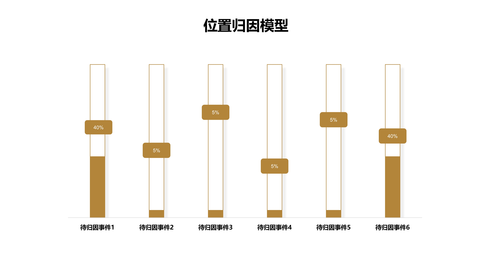

# 归因分析

归因，是指对行为原因的推论过程。归因分析在业务中，通常是用来分析可能导致收益产生的行为如banner点击、添加购物车等对收益的贡献效果的一种方法。

目标转化事件通常与收益相关例如：支付订单等，待归因事件可选择对产生收益有一定促进作用的行为事件，例如：详情页浏览、广告位点击等。

## 归因分析界面概览

## 查询条件配置方法

### 配置目标转化事件

目标转化事件，为业务中最终希望触发的事件，通常与产生收益相关，例如：支付订单等。

点击目标转化事件下拉框，选择需要的目标转化事件即可，目标转化事件的可选项来源于全部元事件。

#### 事件属性筛选

点击目标转化事件右侧的**增加筛选**按钮，在展开的筛选条件配置区域内可以对事件进行属性筛选，属性的可选项来源于目标转化事件携带的事件属性，具体的筛选条件规则请参考[筛选条件](../basic/filter.md)。

#### 设置前置关联事件及属性

为更精确得到分析结果，数据分析工作台支持对目标转化事件做属性筛选及前置关联属性设置。

前置关联事件的意义在于提升归因算法的结果精准度，例如当**支付订单**作为目标转化事件时，业务上它的前置事件可能是**提交订单**或者**加入购物车**。

设置前置关联事件时，可以同时设置关联属性，例如目标转化事件设置为**支付订单**，前置关联事件设置为**提交订单**，设置关联属性为**活动名称**，在计算时，只有提交订单与支付订单属于同一个活动名称时才会纳入计算，进一步提升归因算法的结果精准度。

### 配置待归因事件

待归因事件，指的是**对目标转化事件可能产生贡献**的事件，以支付订单为例，待归因事件可以选择**Banner点击**，**Push点击**，**推荐位点击**等事件。

点击待归因事件下拉框，可以勾选多个待归因事件，待归因事件的可选项来源于除目标转化事件外的全部元事件。

#### 事件属性筛选

点击待归因事件右侧的**增加筛选**按钮，在展开的筛选条件配置区域内可以对事件进行属性筛选，属性的可选项来源于选择的待归因事件携带的事件属性合集，具体的筛选条件规则请参考[筛选条件](../basic/filter.md)。

### 增加展示维度

点击**增加展示维度**按钮，可以选择展示维度，选择后归因分析的计算结果将按照所选择的维度值进行展开展示，展示维度的可选项来源于待归因事件携带的事件属性合集。

执行查询后，归因分析的结果列表将同时展示所有维度的数据，详细的分析维度规则请参考[分析维度](../basic/dimension.md)。

### 直接转化参与计算开关


直接转化：用户没有触发待归因事件，通过其他路径触发目标转化事件时，称之为直接转化。


当直接转化参与计算开关为开启状态时，直接转化将纳入归因算法模型进行计算，反之则不会纳入计算。

## 归因分析模型

### 首次触点模型

如果存在多个待归因事件对目标转化事件做出贡献，那么视第一个待归因事件的贡献度为100%。

### 末次触点模型

如果存在多个待归因事件对目标转化事件做出贡献，那么视最后一个待归因事件的贡献度为100%。

### 线性归因模型

如果存在多个待归因事件对目标转化事件做出贡献，那么所有的待归因事件平分贡献度。

### 位置归因模型

如果存在多个待归因事件对目标转化事件做出贡献，那么视第一个和最后一个带归因事件各位40%贡献度，其余待归因事件评分20%的贡献度。

### 时间衰减归因模型

如果存在多个带归因时间对目标转化事件做出贡献，那么视用户行为路径上越靠近目标转化事件的待归因事件贡献度越高。

各个归因模型都具有优势与劣势，选择时需要依据产品的业务逻辑进行最优选择。

## 归因窗口期


归因窗口期：触发待归因事件距离触发目标转化事件的时间限制。

例如目标转化事件为**支付订单**，待归因事件为**Banner点击**，归因窗口期设置为1天，当Banner点击的触发时间距离支付订单触发时间间隔超过1天时，不计为一次有效转化。


归因窗口期的选择有两种标准，分别是当天或者自定义：

* 当天

当选择当天时，指的是在触发待归因事件的当日24时前触发目标转化事件计为一次有效转化，否则不纳入转化计算。

* 自定义

当选择自定义时，可以从**分钟**，**小时**，**天**三种时间单位中选择一个进行自定义配置。

| 时间单位 | 自定义值上限 |
| ---- | ------ |
| 分钟   | 1440   |
| 小时   | 168    |
| 天    | 180    |

## 公共筛选条件

.gif>)

公共筛选条件同时对**目标转化事件**与**待归因事件**生效，可以选择的属性来源于待归因事件与目标转化事件携带的事件属性合集与全部的用户属性。

关于公共筛选条件的配置方法与计算逻辑，请参考[筛选条件](../basic/filter.md)。

## 分析用户群

.gif>)

点击分析用户群下拉框，可以选择需要分析的特定用户群，此下拉框内的可选项来源于已经创建完成的用户分群，如何创建用户分群请参考[用户分群](../userdivision.md)。

## 归因分析结果图表解释


总点击次数：待归因事件在满足所设置的时间及属性条件下所出现的次数。直接转化的总点击数为目标转化事件回溯无待归因事件的次数。

有效转化：待归因事件后续有目标转化事件的计一次有效转化。

转化系数：根据五种分析模型所计算出的贡献度。

转化系数百分比：当前待归因事件转化系数/全部待归因事件转化系数总和。

