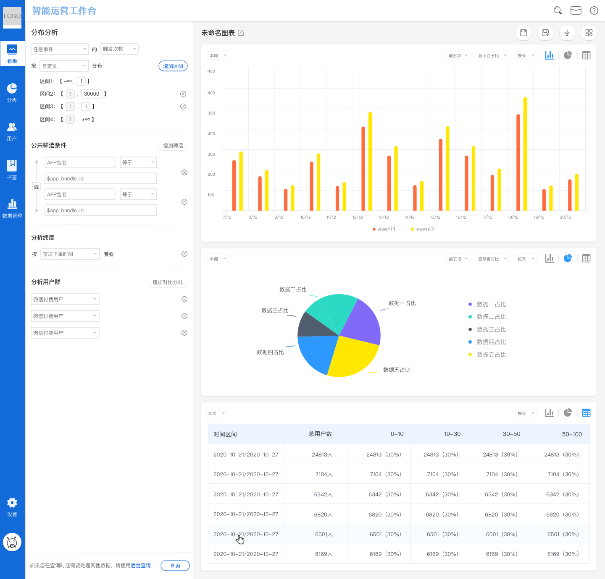
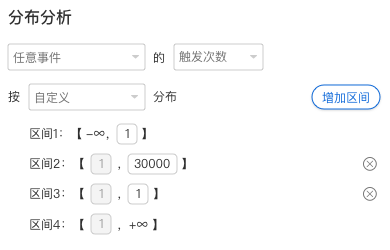
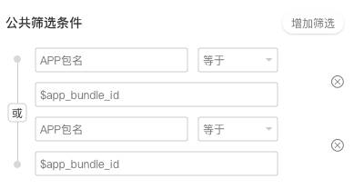

# 分布分析

分布分析，主要用于分析存量用户的某个数据指标分布规律，例如对存量用户群**付费次数**的分布情况进行分析，洞察用户的复购规律。结合用户分群，可以横向对比新老客群在某个数据指标分布情况上的差异，进一步洞察用户群体。

## 分布分析界面概览

## 查询条件配置方法

分布分析的查询条件结构主要分为两种：

### 事件+事件指标


事件：事件的可选项来源于元事件，点击下拉框可以选择单个元事件作为分析主体

事件指标：事件指标可选择触发次数与触发时间两种，计算规则见下方


#### 触发次数

| 用户ID     | App启动事件触发次数 |
| -------- | ----------- |
| zall\_1  | 10          |
| zall\_2  | 14          |
| zall\_3  | 30          |
| zall\_4  | 24          |
| zall\_5  | 3           |
| zall\_6  | 23          |
| zall\_7  | 19          |
| zall\_8  | 33          |
| zall\_9  | 21          |
| zall\_10 | 25          |

#### ​**数据样例**​

触发次数，指的是以一定的区间划分规则为基础，计算单个用户的触发次数隶属于哪个区间，最后得到存量用户的整体分布情况。

以上方的数据样例解释，我们可以把区间划分为：

| 区间       | 用户数 |
| -------- | --- |
| \[0,10)  |     |
| \[10,20) |     |
| \[20,30) |     |
| \[30,40) |     |
| \[40,+∞) |     |

然后计算每个用户触发次数的归属区间，可以得到下方的结果：

| 区间       | 用户数                              |
| -------- | -------------------------------- |
| \[0,10)  | zall\_5                          |
| \[10,20) | zall\_1；zall\_2；zall\_7          |
| \[20,30) | zall\_4；zall\_6；zall\_9；zall\_10 |
| \[30,40) | zall\_3；zall\_8                  |
| \[40,+∞) |                                  |

#### 触发时间

| 用户ID     | App启动事件触发时间        |
| -------- | ------------------ |
| zall\_1  | 2020-1-20 14:48:41 |
| zall\_2  | 2020-1-15 17:53:40 |
| zall\_3  | 2020-1-17 17:06:20 |
| zall\_4  | 2020-1-20 19:50:59 |
| zall\_5  | 2020-2-19 20:13:00 |
| zall\_6  | 2020-2-15 13:40:51 |
| zall\_7  | 2020-2-17 20:20:24 |
| zall\_8  | 2020-2-20 11:14:29 |
| zall\_9  | 2020-2-15 16:09:39 |
| zall\_10 | 2020-2-16 21:51:12 |

#### ​**数据样例**​

触发时间，是按照每日24小时等分，计算单个用户的触发时间隶属于哪个小时区间内，最后得到存量用户的整体分布情况。

以上方的数据样例来解释，我们把App启动的触发时间按默认区间划分：

| 区间       | 用户数             |
| -------- | --------------- |
| \[0,1)   |                 |
| \[1,2)   |                 |
| \[2,3)   |                 |
| \[3,4)   |                 |
| \[4,5)   |                 |
| \[5,6)   |                 |
| \[6,7)   |                 |
| \[7,8)   |                 |
| \[8,9)   |                 |
| \[9,10)  |                 |
| \[10,11) |                 |
| \[11,12) | zall\_8         |
| \[12,13) |                 |
| \[13,14) | zall\_6         |
| \[14,15) | zall\_1         |
| \[15,16) |                 |
| \[16,17) | zall\_9         |
| \[17,18) | zall\_2；zall\_3 |
| \[18,19) |                 |
| \[19,20) | zall\_4         |
| \[20,21) | zall\_5；zall\_7 |
| \[21,22) | zall\_10        |
| \[22,23) |                 |
| \[23,24) |                 |

### 事件+事件属性+属性指标


事件：事件的可选项来源于元事件，点击下拉框可以选择单个元事件作为分析主体

事件属性：所选择事件携带的全部事件属性

属性指标：根据属性的数据类型选择的相应属性指标​


| 属性数据类型 | 可选指标 |
| ------ | ---- |
| 数值类型   | 总和   |
| 最大值    |      |
| 最小值    |      |
| 均值     |      |
| 去重数    |      |
| 日期时间类型 | 去重数  |
| 布尔类型   | 去重数  |
| 字符串类型  | 去重数  |

只有当属性的数据类型为**数值类型**时，才可以配置自定义区间，其他数据类型无法配置自定义区间，具体的分布规则与上方示例相同。

### 自定义区间

### 事件+事件指标结构

当分布分析配置为事件+事件指标的结构时，只有**触发次数**指标可以选择自定义区间，点击自定义区间右侧的**配置**按钮，在弹出的窗口内配置各个区间的划分标准，最后点击确定即可保存自定义区间划分标准，执行查询后，查询的结果将按照自定义区间的划分标准进行分布。

### 事件+事件属性+属性指标

当分布分析配置为事件+事件属性+属性指标的结构时，只有**数值类属性**指标可以选择自定义区间，配置的方法同上。

## 公共筛选条件

公共筛选条件主要对查询条件中选择的事件生效，属性可选项来源于查询条件中选择的事件所携带的事件属性以及全部的用户属性，详细的筛选条件规则请参考[筛选条件](../basic/filter.md)。

## 分析维度

选择分析维度后，分布分析的查询结果将按照维度值分组展示，维度可选项来源于查询条件中选择的事件所携带的事件属性以及全部的用户属性。

执行查询后，分布分析的结果图表将同时展示所有分组的数据，详细的分析维度规则请参考[分析维度](../basic/dimension.md)。


当选择某个分析维度后，对比用户群的功能将被禁用，只能选择单个用户群或所有用户进行分析


## 分析用户群

点击分析用户群下拉框，可以选择需要分析的特定用户群，此下拉框内的可选项来源于已经创建完成的用户分群，如何创建用户分群请参考[用户分群](../userdivision.md)。


当选择了两个及两个以上的用户群进行对比分析时，分析维度选项将被禁用


## 时间范围选择

点击图表展示区左侧的**时间范围选择器**，可以选择查询的数据时间范围。关于时间范围选择的详细信息请参考[时间范围](../basic/timerange.md)。

## 保存书签

.png>)

点击**保存**按钮后，可以将此次配置的查询条件保存为书签：


书签名称：必填项，该书签的名称。

同时添加至数据看板：可选项，选择具体的数据看板后，此次配置的查询条件将保存为书签同时在选择的数据看板内展示。如此选项留空，则只会保存为书签，后续可在书签管理模块管理此书签。


## 数据下载

.png>)

智能分析平台支持将数据下载至本地进行二次应用，点击**下载**按钮后，查询得到的数据将以csv的格式下载至本地，下载进度可以在页面上方的消息中心查看。

## 业务实例

在用户增长的方法论中，有一个关键的数据指标---**复购魔法数字**，它指的是随着用户复购次数的提升，当达到某个关键数字之前，用户的流失率维持在较高的水平，当达到某个关键数字之后，用户的流失率将开始降低，成为产品的忠诚用户，这个关键数字，就是复购魔法数字。

在新用户的获取成本远高于维护老用户的情况下，维护好老用户带来的价值收益也明显高于将成本投入到获取新用户上，所以如何找到复购魔法数字，如何利用复购魔法数字驱动营销增长，成为了企业亟待解决的问题。

通过数据分析工作台的用户分群模块，我们可以按照复购次数，将整体用户划分为不同的用户群体，例如复购1次用户群，复购2次用户群等等。

接下来，我们使用留存分析模块，横向对比不同复购次数用户群的流失情况，当发现用户群大于某个复购次数时，用户的流失率开始显著下降以后，我们就找到了复购魔法数字。

最后，我们使用分布分析模块，整体洞悉现阶段存量用户的复购次数分布，如果复购次数低于复购魔法数字，那么我们可以用促销等运营手法，提升存量用户的复购次数，将更多的用户转化为产品忠诚用户，如果复购次数高于复购魔法数字，那么运营重心可以转移到提升用户粘性，用裂变的手法，以较低的成本获取新用户，让产品的用户体系保持正向的健康循环。
