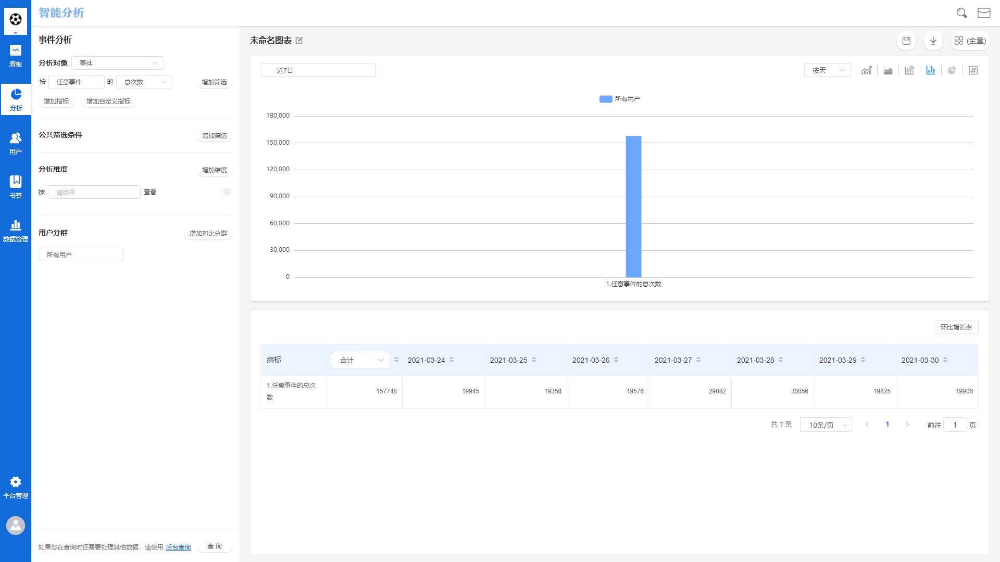
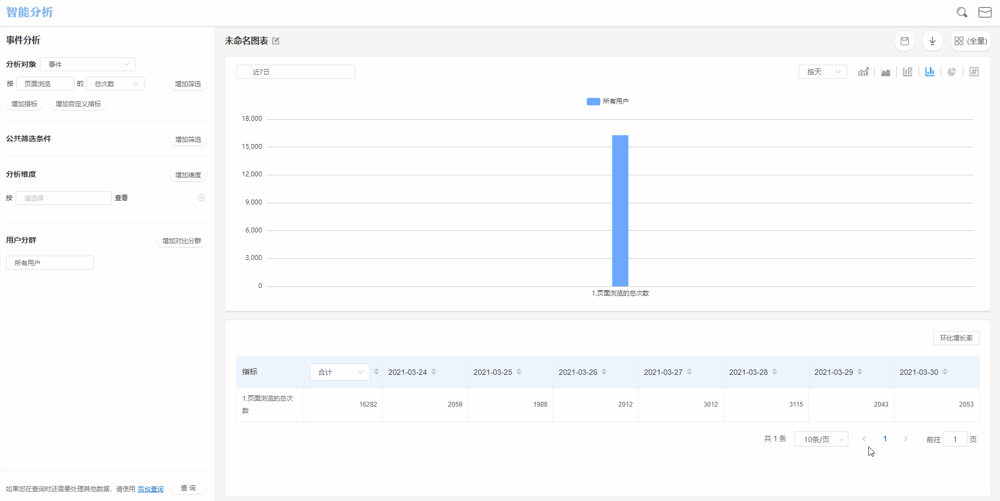
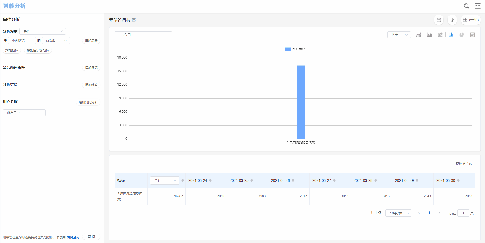
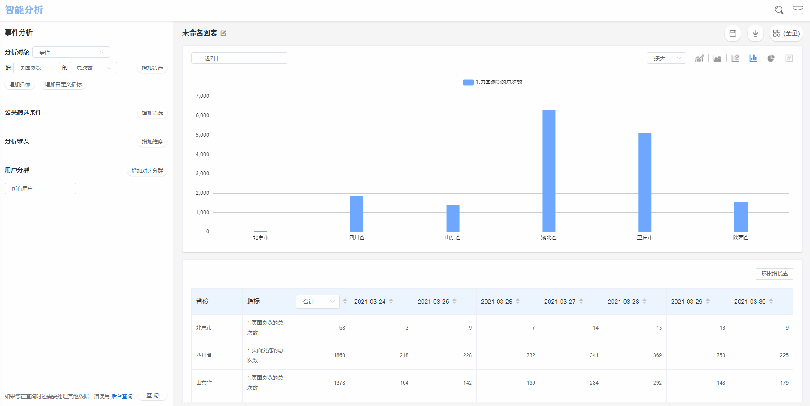
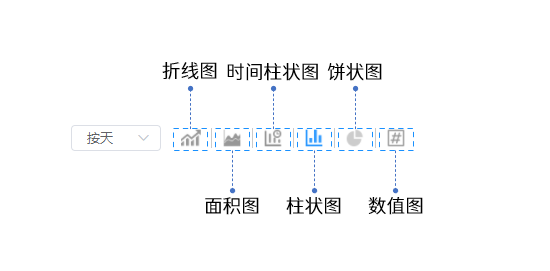
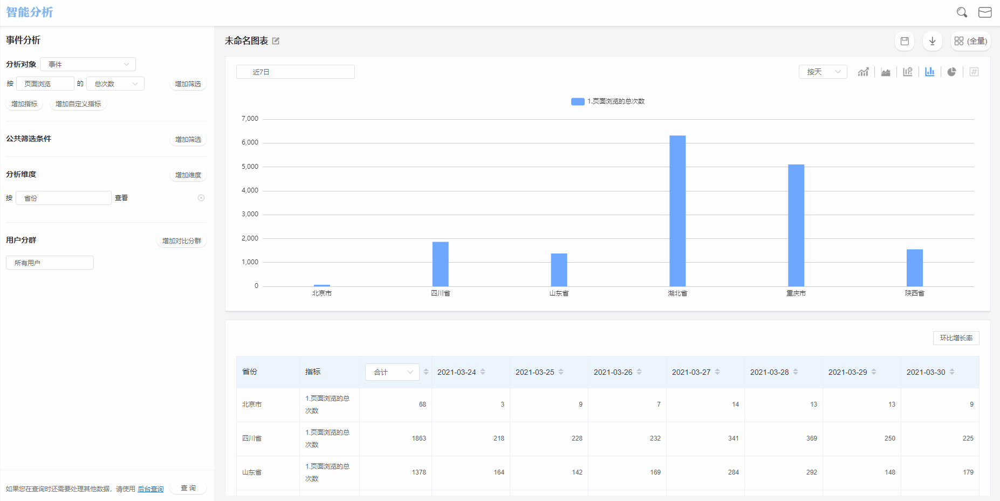

# 事件分析

## 事件分析界面概览

## 查询条件配置方法

### 选择事件与指标

* 事件+事件指标

例如选择APP启动+总次数，代表数据查询时间范围内，触发了**APP启动事件**的总次数。

数据分析工作台内置了三种通用的事件指标，分别是**总次数**，**用户数**与**人均次数**。

* 事件+事件属性+属性指标

例如选择支付订单+订单金额+总和，代表数据查询时间范围内，全部支付订单事件中，订单金额属性的属性值总和。

在选择属性指标时，根据数据的数据类型不同，可以选择的属性指标也有所不同，关于指标的详细解释，请参考[指标](../basic/indicators.md)。


当分析用户群数大于1且分析维度数大于1时，最多选择1个事件指标


### 为选择的事件添加筛选条件

点击事件右侧的**增加筛选**按钮，即可为此事件添加筛选条件，筛选条件中的属性可选项来源于此事件携带的事件属性与全部的用户属性，具体的筛选条件规则请参考[筛选条件](../basic/filter.md)。

### 同时展示多个事件与指标

在已经选择的事件指标下方点击**增加指标**按钮，即可添加一个事件指标，多个事件指标共存时，可以选择相同的事件。

## 公共筛选条件

设置公共筛选条件后，将对事件分析中选择的所有事件指标同时进行筛选，筛选条件的属性来源于全部事件携带的事件属性合集与全部的用户属性。

具体的筛选条件计算规则请参考[筛选条件](../basic/filter.md)。

## 分析维度

选择分析维度后，事件分析的查询结果将按照维度值分组展示，维度可选项来源于查询条件中选择的事件所携带的事件属性以及全部的用户属性。

执行查询后，事件分析的结果图表将同时展示所有分组的数据，详细的分析维度规则请参考[分析维度](../basic/dimension.md)。


当事件指标大于1时且分析用户群数大于1时，最多选择1个分析维度


## 分析用户群

点击分析用户群下拉框，可以选择需要分析的特定用户群，此下拉框内的可选项来源于已经创建完成的用户分群，如何创建用户分群请参考[用户分群](../userdivision.md)。


当事件指标大于1且分析维度数大于1时，最多选择1个分析用户群


## 自定义指标

如果需要对指标进行四则运算得到数据结果，可以使用自定义指标来解决问题：

#### 添加自定义指标

点击事件选择器下方的**增加自定义指标**按钮，将展现自定义指标选择器，点击选择器后页面右侧将弹出自定义指标的配置抽屉，配置过程中需要配置四个部分：

* 自定义指标名称

自定义指标名称用以标识此自定义指标，可以根据实际需求自行设置，例如想要分析成单转化率，可以将自定义指标名称设置为**成单转化率**。

* 自定义指标计算条件

自定义指标计算条件的配置由元事件、元事件指标、四则运算符组成，点击计算条件配置区，将弹出事件选择下拉框，下拉框内的内容由全部的元事件组成，选择需要的元事件与元事件指标，并输入对应的四则运算符即可。


此处的元事件指标支持属性筛选，筛选规则与事件筛选及公共筛选的规则相同。


* 设置显示格式

此处用以设置计算结果的显示格式，可以从**整数、两位小数、百分比**三种显示格式中选择一个。

* 设置显示单位

此处用以设置计算结果的显示单位，例如**元/人**，非必填。

#### 保存自定义指标

配置完成自定义指标之后，可以点击保存公式按钮，便于之后复用。

#### 使用自定义指标

配置完成自定义指标之后，可以点击右下加的**使用公式**按钮，接下来，点击查询条件配置区的**查询**按钮，即可根据自定义指标的计算条件，得到数据结果。


四则运算符支持+、-、\*、/、()，输入过程中需要保证为英文格式。



自定义指标样例：

例如需要配置男性用户成单转化率，可以通过以下步骤进行配置：

① 选择支付订单事件，指标选择为用户数

② 对指标添加筛选，筛选条件为用户属性-性别-等于-男

③ 输入“/”符号。

④ 选择提交订单事件，指标选择为用户数

⑤ 为此指标添加筛选，筛选条件为用户属性-性别-等于-男

⑥ 选择显示格式为百分比

⑦ 点击使用公式，点击查询按钮，即可得到计算结果


## 时间范围选择

点击图表展示区左侧的**时间范围选择器**，可以选择查询的数据时间范围。关于时间范围选择的详细信息请参考[时间范围](../basic/timerange.md)。

## 数据图表

### 图表

事件分析的分析结果支持六种类型的图表：折线图，面积图，堆叠柱状图，柱状图，饼环图，数值图。

### 表格

当以表格展示数据时，根据选择维度数量的不同，表格的展现有所不同，共分为无维度、单维度、多维度三种情形：

## 保存书签

点击**保存**按钮后，可以将此次配置的查询条件保存为书签：


书签名称：必填项，该书签的名称。

同时添加至数据看板：可选项，选择具体的数据看板后，此次配置的查询条件将保存为书签同时在选择的数据看板内展示。如此选项留空，则只会保存为书签，后续可在书签管理模块管理此书签。


## 数据下载

数据分析工作台支持将数据下载至本地进行二次应用，点击**下载**按钮后，查询得到的数据将以csv的格式下载至本地，下载进度可以在页面上方的消息中心查看。
