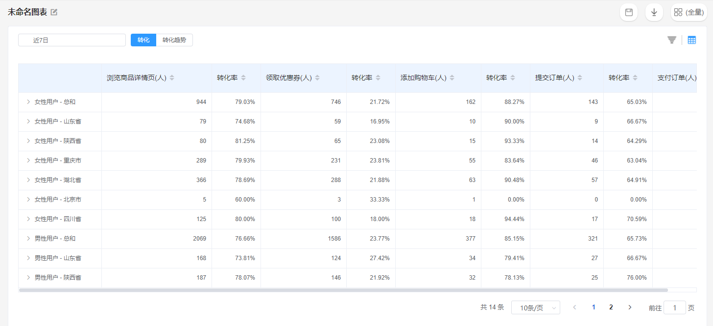

# 漏斗分析

漏斗分析，主要用于分析用户在不同的行为序列关键节点之间的转化与流失情况，例如电商产品中常见的行为序列：**App启动**-**推荐位点击**-**商品详情页浏览**-**提交订单**-**支付订单**，研究用户在这个五个步骤中的转化与流失情况，就构成了一个漏斗模型。

## 漏斗分析界面概览

## 查询条件配置方法

### 配置漏斗参与步骤

一个完整的漏斗模型，由最少两个漏斗步骤组成。在默认进入漏斗分析模块时，查询条件配置区域设有两个步骤，点击**增加步骤**按钮，可以增加一个步骤。

确定漏斗步骤数量以后，点击每个步骤的事件选择下拉框，可以从所有元事件中选择一个作为该步骤的事件。

### 漏斗步骤筛选

点击每一个漏斗参与步骤右侧的**增加筛选**按钮，可以对此步骤进行属性筛选，可以选择的属性来源于此步骤选择事件所携带的全部事件属性。

具体的筛选条件计算规则请参考[筛选条件](../basic/filter.md)。

### 设置关联属性

为了提升分析结果的准确性，点击**设置关联属性**后，可以在任意两个步骤之间设定关联属性，当设置了关联属性之后，两个步骤之间携带的关联属性值在相同的情况下，转化数据才会纳入计算，否则将不纳入计算。


例如设定如下的漏斗模型：

App启动-推荐位点击-商品详情页浏览-提交订单-支付订单

在后面四个步骤之间设定关联属性为**活动名称**，执行查询后，用户在触发后四个步骤时，只有活动名称一致时才会纳入漏斗模型计算，否则将不纳入计算。

如果不设定关联属性，当用户点击了推荐位后返回首页，搜索商品后提交了订单并支付，但是订单内的商品并不是推荐位推荐的商品时，漏斗模型仍然会将此用户计算为成功转化用户，然而该用户并不是漏斗模型业务意义上的成功转化用户。


### 转化周期


转化周期：用户成功从漏斗模型的第一个步骤依次触发至最后一个步骤的时间限制，例如将转化周期设置为7天，以用户触发漏斗模型的第一个步骤时间点为起始时间，7天之内用户依次触发完漏斗模型的其余步骤，则视为一个成功转化用户，否则视为流失用户。


数据分析工作台提供了**分**，**小时**，**天**三种时间单位可以选择，选择好时间单位后，在转化周期输入栏输入具体的值即可完成转化周期的设置。

| 时间单位 | 自定义值上限 |
| ---- | ------ |
| 分钟   | 1440   |
| 小时   | 168    |
| 天    | 180    |

## 公共筛选条件

.gif>)

设置公共筛选条件后，将对漏斗模型的所有步骤同时进行筛选，筛选条件的属性来源于全部漏斗参与步骤携带事件属性的合集与全部的用户属性。

具体的筛选条件计算规则请参考[筛选条件](../basic/filter.md)。

## 分析维度

### 漏斗分析中分析维度的特殊应用

.gif>)

漏斗分析的分析维度与通用的分析维度不同，此处选择分析维度后，将应用至两个部分：

#### 维度变化趋势辅助图表

在展示功能区的图表展示状态下，漏斗转化图下方将同时展示所选维度按照时间的变化趋势。

#### 漏斗转化数据表按所选维度分组

在展示功能区的数据表展示状态下，表格将按照所选的维度进行分组，点击纬度值旁的**展开按钮**，将按照数据查询时间范围逐日展开。

分析维度选择**数值类型**或**日期时间类型**的自定义分组区间规则，请参考[分析维度](../basic/dimension.md)。


以上两种分析维度的应用互相独立


### 漏斗分析中的分组逻辑

在漏斗分析中，分析维度可以选择**任意步骤属性**、**某一步骤属性**或**用户属性**：


任意步骤属性：当前漏斗的全部步骤携带的事件属性合集

某一步骤属性：当前漏斗中的某一个步骤携带的事件属性。

用户属性：全部的用户属性


当选择任意步骤属性中的某个属性作为分析维度时，按照每个用户此属性的首次有效值进行分组。

当选择某一个步骤中的属性作为分析维度时，当用户转化至此步骤，则按照属性值进行分组，如果用户没有转化至此步骤，则划分为**未知**分组。

当选择用户属性作为分析维度时，按照用户属性进行分组。


一个用户只会出现在一个分组中且漏斗分析中的分析维度最多支持选择1个


## 分析用户群

.gif>)

点击分析用户群下拉框，可以选择需要分析的特定用户群，此下拉框内的可选项来源于已经创建完成的用户分群，如何创建用户分群请参考[用户分群](../userdivision.md)。

## 时间范围选择

点击图表展示区左侧的**时间范围选择器**，可以选择查询的数据时间范围。关于时间范围选择的详细信息请参考[时间范围](../basic/timerange.md)。

## 漏斗图表解释

### 漏斗转化图

对于8个步骤以下的漏斗转化图表，共有三个部分组成：


步骤转化率：图表中的百分比，例如图表上的30%，代表当前用户分群内的全部用户，有30%的用户触发了漏斗模型的第一步，图表上的20%，代表触发漏斗模型第一步的全部用户，有20%触发了漏斗模型的第二步，以此类推。

步骤事件名：图表中的事件名，代表对应漏斗步骤选择的事件。

步骤用户数：图表中的事件名右侧的数字，代表当前步骤成功转化的用户数。


### 漏斗转化趋势图


横轴：时间序列

纵轴：转化率


在漏斗转化趋势图中，可以点击图表上方的**步骤切换**按钮，查看不同步骤间或总体的转化趋势图表。

### 漏斗转化数据表


列：跟据选择的数据查询时间范围递增

行：跟据选择的漏斗步骤数量进行递增，两个漏斗步骤之间为转化率数值。


#### 未选择分析维度

当未选择分析维度时，表格的行表头展示日期，点击总体右侧的**展开**按钮，表格将按照选择的数据查询时间范围逐日展开。

#### 选择分析维度

当选择分析维度时，表格的行表头将按照选择的维度值进行分组展示，点击维度值右侧的**展开**按钮，此分组的表格将按照选择的数据查询时间范围逐日展开。

### 漏斗转化趋势数据表

#### 总体转化趋势数据表


行表头：根据选择的数据查询时间范围递增

列表头：漏斗总体及漏斗的各个转化步骤，各个转化步骤默认为收起状态，点击总体旁的展开按钮，各个步骤将会在表格中展开

表格内容：行列表头二维确定的转化人数及转化率


#### 分步骤转化趋势数据表


行表头：漏斗转化相关指标



用户数：在选择的步骤中，触发前一步的用户数总和，例如选择**第1步到第2步**进行查询，用户数指的是触发**第1步**事件的用户数总和。

转化率：在选择的步骤中，成功从前一个步骤转化至后一个步骤的转化率，例如选择**第1步到第2步**进行查询，转化率指的是成功从第1步转化至第2步的转化率。

未转化用户数：在选择的步骤中，触发前一步而没有触发后一步的用户数，例如选择**第1步到第2步**进行查询，未转化用户数指的是触发**第1步**事件而没有触发**第2步**事件的用户数总和。

转化时间中位数：在选择的步骤中，成功从前一个步骤转化至后一个步骤的转化时间中位数，例如选择**第1步到第2步**进行查询，转化时间中位数指的是，将所有成功转化用户的转化时间从小到大排列以后，位于50%位置的数值。

转化用户数：与未转化用户数相对应，指的是触发前一步且触发了后一步的用户数。


## 保存书签

点击**保存**按钮后，可以将此次配置的查询条件保存为书签：


书签名称：必填项，该书签的名称。

同时添加至数据看板：可选项，选择具体的数据看板后，此次配置的查询条件将保存为书签同时在选择的数据看板内展示。如此选项留空，则只会保存为书签，后续可在书签管理模块管理此书签。


## 数据下载

数据分析工作台支持将数据下载至本地进行二次应用，点击**下载**按钮后，查询得到的数据将以csv的格式下载至本地，下载进度可以在页面上方的消息中心查看。

## 业务实例

例如某产品在为新品做推广时，设计了两套推广页面，并且在存量用户中随机划分了一定量的用户进行A/B-test，为了分析哪个页面的推广效果比较好，我们可以设计两套漏斗用以监测两套推广页面的转化效果：

（1）点击推广入口1-浏览推广页面1-浏览商品详情页-提交订单-支付订单

（2）点击推广入口2-浏览推广页面2-浏览商品详情页-提交订单-支付订单

漏斗条件配置完成之后，可以将其保存为书签放置在看板上进行实时监测，并且在经过测试期后，横向对比哪种推广页面的转化效果比较好。

或者为了横向对比新老用户群体在同一个漏斗中的转化情况，可以在用户分群中创建新客客群以及老客客群，配置漏斗条件如下：

漏斗模型：App启动-首页浏览-点击商品-浏览商品详情页-提交订单-支付订单

分析用户群：新客客群&老客客群

将其保存为书签以后，可以在数据看板上实时监测两个用户群在同一个漏斗中的转化情况。
