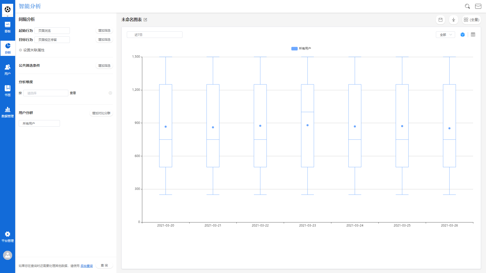
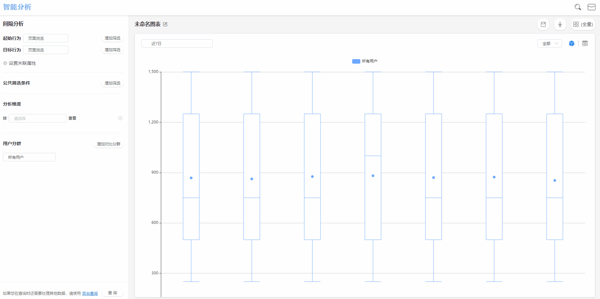
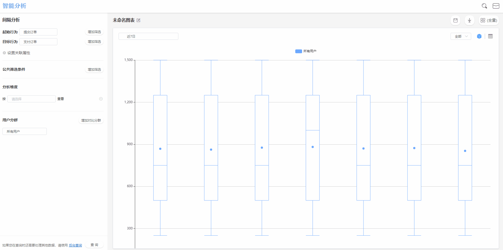
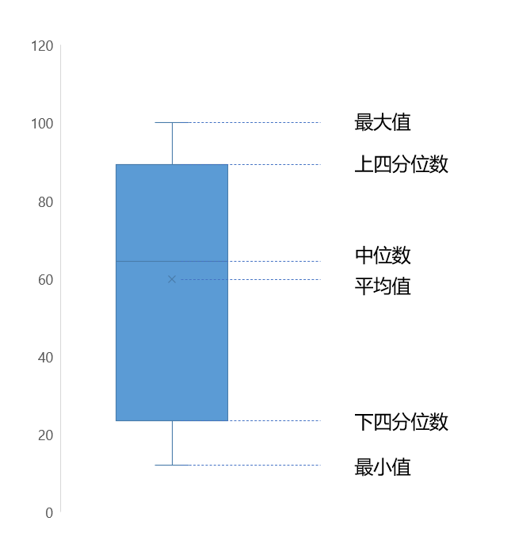
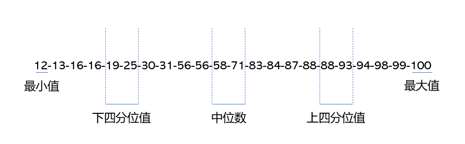
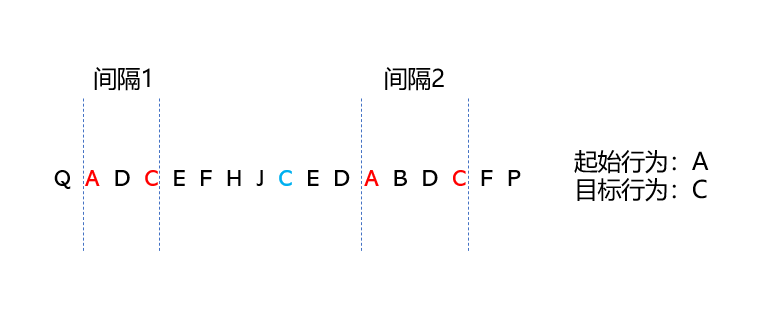

# 间隔分析

## 间隔分析界面概览

## 查询条件配置方法

间隔分析主要用于分析两个事件之间的**间隔时间**统计学指标，使用间隔分析模块时，需要在查询条件配置区配置**起始行为**与**目标行为**。

起始行为及目标行为的所有可选项来源于元事件，二者可以选择为同一个事件。


起始与目标指代的是一组时间间隔中的起始行为与目标行为，例如从提交订单到支付订单的转化，提交订单为起始行为，支付订单为目标行为。


### 行为筛选

点击**增加筛选**按钮，可以单独对起始行为或目标行为添加筛选条件，筛选的属性来源于其携带的事件属性与全部的用户属性，具体的筛选条件配置方法与计算逻辑可参考[筛选条件](../basic/filter.md)。


例如起始行为选择提交订单，需要筛选出**双11促销活动**的订单，可以在起始行为后方点击增加筛选按钮，配置筛选条件：**活动名称-等于-双11促销活动**。配置完成后只有双11促销活动的提交订单数据才会纳入计算。


### 设置关联属性

.gif>)

为了提升分析结果的准确性，间隔分析支持用户设置关联属性，关联属性的属性可选项来源于起始行为与目标行为的属性交集。

当设置了关联属性之后，起始行为与目标行为中携带的该属性值在相同的情况下，间隔时间数据才会纳入计算，否则将忽略此间隔时间数据。


某产品在首页的Banner位为新品做推广，如果想要分析此Banner对于新品成单的引导效果，需要设置关联属性为**活动名称**，这样可以保证纳入计算的都是新品的成单数据。

如果不设置关联属性，某用户点击Banner后退出，然后购买了其他活动商品，这种情景下也会将间隔数据纳入计算，导致结果存在偏差。


## 公共筛选条件

.gif>)

公共筛选条件与行为筛选不同，公共筛选条件同时对起始行为与目标行为生效，可以选择的属性来源于起始行为与目标行为携带属性的合集与全部的用户属性。

关于公共筛选条件的配置方法与计算逻辑，请参考[筛选条件](../basic/filter.md)。

## 分析维度

.gif>)

间隔分析支持按照不同的维度分组查看查询结果，点击分析维度下拉框，选择需要的维度后，查询结果将按照选择的维度分组展示。

间隔分析中的分析维度可选项分为三种：

* 起始行为事件属性

该分类下包含起始行为携带的全部事件属性，例如起始行为选择**注册**，目标行为选择**分享**，选择注册事件中的**来源渠道**当作分析维度时，查询结果将按照来源渠道进行分组展示。

* 目标行为事件属性

该分类下包含目标行为携带的全部事件属性，例如起始行为选择**提交订单**，目标行为选择**支付订单**，选择支付订单事件中的**支付方式**当作分析维度时，查询结果将按照支付方式进行分组展示。

* 用户属性

该分类下包含全部用户属性，例如选择**城市**属性，查询结果将按照城市进行分组展示。


当选择某个分析维度后，对比用户群的功能将被禁用，只能选择单个用户群或所有用户进行分析


## 分析用户群

.gif>)

点击分析用户群下拉框，可以选择需要分析的特定用户群，此下拉框内的可选项来源于已经创建完成的用户分群，如何创建用户分群请参考[用户分群](../userdivision.md)。


当选择了两个及两个以上的用户群进行对比分析时，分析维度选项将被禁用


## 时间范围选择

点击图表展示区左侧的**时间范围选择器**，可以选择查询的数据时间范围。关于时间范围选择的详细信息请参考[时间范围](../basic/timerange.md)。

## 保存书签

点击**保存**按钮后，可以将此次配置的查询条件保存为书签：


书签名称：必填项，该书签的名称。

同时添加至数据看板：可选项，选择具体的数据看板后，此次配置的查询条件将保存为书签同时在选择的数据看板内展示。如此选项留空，则只会保存为书签，后续可在书签管理模块管理此书签。


## 数据下载

数据分析工作台支持将数据下载至本地进行二次应用，点击**下载**按钮后，查询得到的数据将以csv的格式下载至本地，下载进度可以在页面上方的消息中心查看。

## 盒须图解释

间隔分析的图表只有**盒须图**一种，盒须图样例及数据样例如下图所示：

盒须图由六部分组成：


最大值：一组数据按照从小到大的顺序进行排列后得到的最大值，即数据示例中的100

最小值：一组数据按照从小到大的顺序进行排列后得到的最小值，即数据示例中的12

平均值：一组数据求和后除以数据的个数，数据样例中为1317/22=59.86

下四分位值：一组数据按照从小到大的顺序进行排列后，位于25%位置的数值，即数据示例中的（19+25）/2=22

中位数：一组数据按照从小到大的顺序进行排列后，位于50%位置的数值，即数据示例中的（58+71）/2=64.5

上四分位值：一组数据按照从小到大的顺序进行排列后，位于75%位置的数值，即数据示例中的（88+93）/2=90.5


## 间隔分析基本计算方法

### 时间间隔的统计学指标

间隔分析主要计算的是**起始行为**与**目标行为**之间的时间间隔，当用户产生行为数据后，上报的数据会携带事件的触发时间数据，间隔分析就是以此为基础，计算出一系列的统计学指标用以分析。

假设用户的行为序列如上图所示，在间隔分析模块中设定**起始行为**为**A**，**目标行为**为**C**，对于单个用户来说，工作台的工作流程如下：

（1）以用户为主体，获取用户行为序列

（2）寻找起始行为A，获取时间戳数据

（3）寻找距离起始行为A最近的目标行为C，获取时间戳数据，得到间隔值

（4）循环第2步与第3步，直至行为序列终止

在对选定的用户群体执行完成上述流程后，工作台就获得一系列的时间间隔值，将这些时间间隔值按照从小到大的顺序排列，即可获得**最小值，最大值，平均值，下四分位值，中位数，上四分位值**共六个统计学指标，最后将这些数据输出为盒须图或表格。

### 转化率与转化用户数

在间隔分析的数据展示表格中，设有两个转化指标，分别时转化率与转化用户数：


转化用户数：在触发起始行为后成功触发目标行为的用户数。

转化率：转化用户数/触发起始行为的用户总数。


## 业务实例

### 背景介绍

某企业主营产品为一款社交型App，用户的使用时长是重要的考量指标，为此，企业的技术人员在退出App时做了数据埋点，获取单次用户的使用时长，通过计算平均值的方法分析用户的产品依赖度。

同时，企业为了提升用户粘性，开展了在线时长换取奖励的活动，根据过往的使用时长平均值预估此次活动效果应该会很好，然而，最终活动收尾时，只有少部分用户获取了在线时长奖励，活动效果没有达到预估。

### 问题解析

平均值，经常用来反应数据整体的平均状况，这点对于分布均匀的数据组来说，是很好的考量指标，然而当数据分布不均匀，甚至分布的较为极端的情况下，平均值的效果就会变得很弱甚至会产生误导。

例如下面一组使用时长数据（秒）：

**30，50，50，70，90，110，130，150，200，500，800，2000，10000，10000，15000**

我们单独计算平均值，结果是2612秒，44分钟的使用时长看起来是很健康的单次使用时长，但我们继续计算四分位值时发现，上四分位值为2000，也就是说，75%的用户没有达到平均值，差距有612秒。

所以在背景中，运营人员很有可能被使用时长平均值误导，错误的设置了活动的在线时长奖励活动的在线时长阈值，导致最终只有小部分用户获得了奖励。
