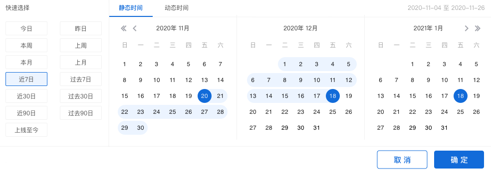

# 路径分析

路径，表示用户的行为路径，当用户在使用产品时，会进行一系列的操作，这些操作所产生的行为数据都会以事件的形式进行采集，将这些事件数据以时间顺序进行排列，即用户的行为路径。

## 路径分析界面概览

## 查询条件配置方法

.gif>)

### 配置参与分析的事件

#### 选择参与分析的事件

点击下拉框可进行参与事件的选择，可选择全部或部分事件，事件来源于元事件。选择全部事件可获得用户的完整路径，选择部分事件则可针对某些关键事件进行分析。

#### 事件分组

完成事件选择后，点击右侧**维度划分**则可对所选择事件进行分组。分组选择左侧框为所选择的参与分析的事件，右侧框为该事件属性。可增加多个事件分组，但一个事件只支持一个分组。

### 配置目标事件

#### 选择目标事件

目标事件的结构为：**起始事件/结束事件+具体事件**，表示以某事件为起点或以某事件为终点进行用户路径的查询。


起始事件：以该事件的时间戳为起始时间，在这个时间节点之后的属于查询时间范围内的事件将组合成该事件的后续路径图。

结束事件：以该事件的时间戳为终止事件，在这个时间节点之前的属于查询时间范围内的事件将组合成该事件的前序路径图。


具体事件的选项来源于**配置参与分析的事件**中选择的事件。

#### 目标事件的筛选

点击目标事件右侧的**增加筛选**按钮，即可为目标事件添加筛选条件，筛选条件的属性可选项来源于目标事件携带的事件属性，具体的筛选条件规则请参考[筛选条件](../basic/filter.md)。

### 配置事件间隔时间

事件间隔时间表示用户路径是否连接的判断条件，如果两个独立事件之间的时间间隔超过了设置的事件间隔时间，则此用户将被判定为前一个节点的流失用户，否则将归属于转化用户。

例如以**浏览商品详情页**至**提交订单**作为两个相邻的路径节点，将事件间隔时间设置为30分钟，如果用户在浏览商品详情页后30分钟内触发了提交订单，则视为浏览商品详情页节点的转化用户，否则将视为浏览商品详情页节点的流失用户。

## 用户筛选

.gif>)

租户可以使用用户筛选功能对参与计算的用户进行筛选，用户属性的筛选结构为**用户属性-逻辑运算关系-属性值**，通过用户属性的筛选，我们可以针对某个特定的用户群体进行分析，例如选择**城市**等于**北京市**，那么将会对北京市的用户进行针对性的留存分析，多个用户属性之间可以选择**逻辑关系**，详情参见[筛选条件](../basic/filter.md)。


用户筛选过程先于路径分析模型计算，即先将选定用户群根据筛选条件进行筛选，然后以筛选后的用户群为基础进行路径分析计算


## 分析用户群

.gif>)

点击分析用户群下拉框，可以选择需要分析的特定用户群，此下拉框内的可选项来源于已经创建完成的用户分群，如何创建用户分群请参考[用户分群](../userdivision.md)。

## 时间范围选择

点击图表展示区左侧的**时间范围选择器**，可以选择查询的数据时间范围。关于时间范围选择的详细信息请参考[时间范围](../basic/timerange.md)。

## 保存书签

点击**保存**按钮后，可以将此次配置的查询条件保存为书签：


书签名称：必填项，该书签的名称。



路径分析的查询结果无法保存至数据看板


## 数据下载

数据分析工作台支持将数据下载至本地进行二次应用，点击**下载**按钮后，查询得到的数据将以csv的格式下载至本地，下载进度可以在页面上方的消息中心查看。

## 路径分析桑基图解释

#### 节点悬停信息

在路径分析图上，每一块蓝色的区域代表一个**路径节点**，以事件名作为标识，事件名下方的数字代表该节点的访问量，鼠标悬停于某个蓝色区域时，会展开该节点留存量与流失量数据。

在路径分析图上，鼠标点击蓝色区域，将展开两个选项，**突出通过该节点的路径**与**查看节点详细信息**：


突出通过该节点的路径：点击突出通过该节点的路径后，所有通过该节点的**路径节点**及**路径线**将高亮显示。

查看节点详细信息：点击查看节点详细信息后，下图将以弹窗的形式展示，数据指标如下图所示。


#### 查看节点详细信息


合计：该节点的事件访问总次数。

后续事件统计：通过该节点后，触发后续事件并与该节点事件连接为行为路径的流量总和。

后续事件流失数：通过该节点后，不再触发其他事件或触发其他事件与该节点时间间隔超过限制的流量总和。

后续事件：通过该节点后，流量流向哪些路径节点，各个节点的流量占比情况。

前置事件：流量从哪些节点流向该节点，各个节点的流量占比情况。


## 路径分析计算方法

从实际的使用角度看，用户在触发了一次事件之后，之后两种可能，触发下一个事件或终止使用产品，以时间为标尺，我们就得到了一个用户的行为路径，下面我们将实际的查询过程简化，说明行为路径的简单原理。

|      | 节点1 | 节点2 | 节点3 | 节点4 | 节点5 | 节点6 | 节点7 | 节点8 | 节点9 |
| ---- | --- | --- | --- | --- | --- | --- | --- | --- | --- |
| 用户1  | A   | T   | R   | E   | O   | Y   | H   | M   | B   |
| 用户2  | A   | C   | A   | R   | K   | J   | B   | N   | G   |
| 用户3  | A   | K   | Q   | C   | M   | A   | Z   | T   | G   |
| 用户4  | A   | R   | D   | V   | X   | F   | T   | C   | F   |
| 用户5  | A   | T   | O   | B   | C   | G   | B   | V   | J   |
| 用户6  | A   | I   | X   | B   | U   | D   | E   | S   | M   |
| 用户7  | A   | K   | E   | K   | E   | H   | U   | C   | P   |
| 用户8  | A   | X   | S   | B   | V   | E   | K   | P   | O   |
| 用户9  | A   | B   | X   | I   | A   | I   | E   | B   | B   |
| 用户10 | A   | N   | H   | A   | E   | V   | B   | Y   | B   |

上图为一张简单的用户行为路径图，我们按照时间顺序从左到右排列完成，现在在路径分析中，我们取**A、B、C、D、E**为参与分析事件，**A**为**起始事件**，则上方的路径图可以变成下方所示：

|      | 节点1   | 节点2   | 节点3   | 节点4   | 节点5   | 节点6   | 节点7   | 节点8   | 节点9   |
| ---- | ----- | ----- | ----- | ----- | ----- | ----- | ----- | ----- | ----- |
| 用户1  | **A** | T     | R     | **E** | O     | Y     | H     | M     | **B** |
| 用户2  | **A** | C     | **A** | R     | K     | J     | **B** | N     | G     |
| 用户3  | **A** | K     | Q     | **C** | M     | **A** | Z     | T     | G     |
| 用户4  | **A** | R     | **D** | V     | X     | F     | T     | **C** | F     |
| 用户5  | **A** | T     | O     | **B** | C     | G     | **B** | V     | J     |
| 用户6  | **A** | I     | X     | **B** | U     | D     | **E** | S     | M     |
| 用户7  | **A** | K     | **E** | K     | **E** | H     | U     | C     | P     |
| 用户8  | **A** | X     | S     | **B** | V     | **E** | K     | P     | O     |
| 用户9  | **A** | **B** | X     | I     | **A** | I     | **E** | **B** | **B** |
| 用户10 | **A** | N     | H     | **A** | **E** | V     | **B** | Y     | **B** |

随后可以简单的统计，由A-A的用户有2人，由A-B的用户有4人，由A-C的用户有1人，由A-D的用户有1人，由A-E的用户由2人，我们得到了路径图的第一部分，接下来依此类推，用户在产品上操作的行为越多，操作的时间越久，我们可以得到的用户路径就更全面准确。

如果上图中将A设为结束事件，那么整体流程将变为时间逆序计算节点展示，其余过程不变。
