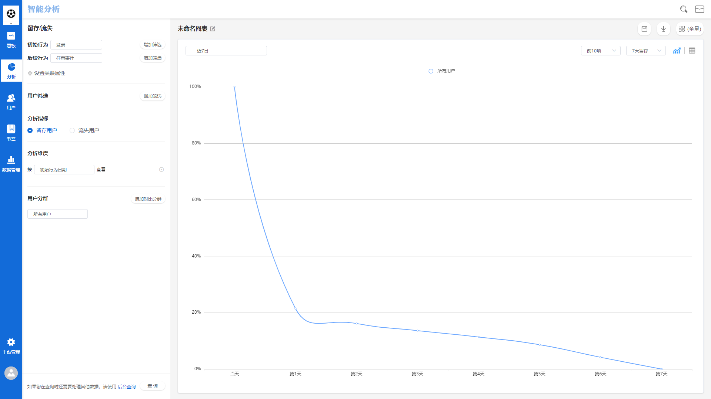
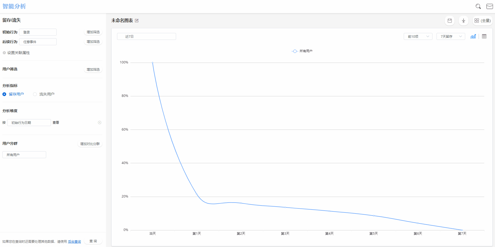
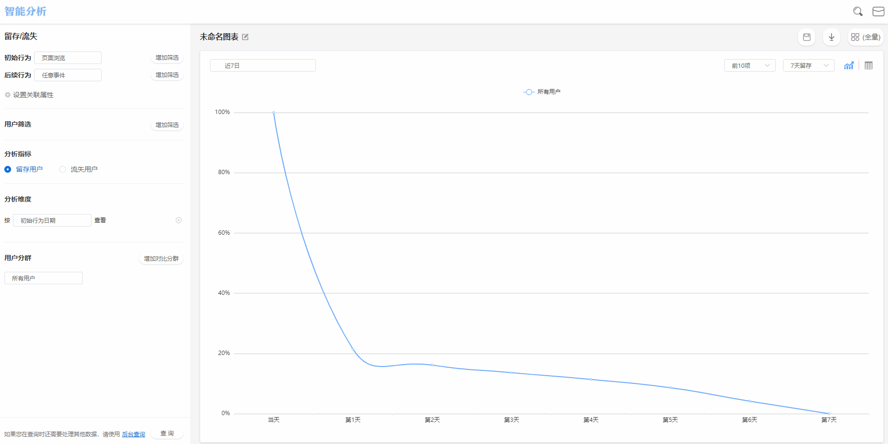
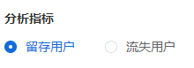
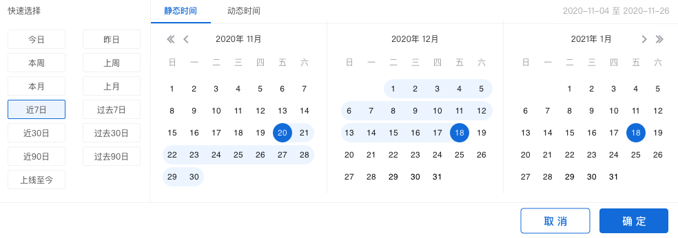
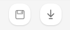
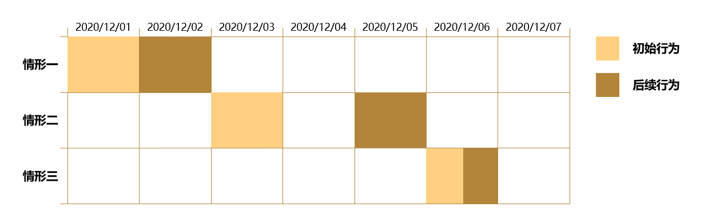
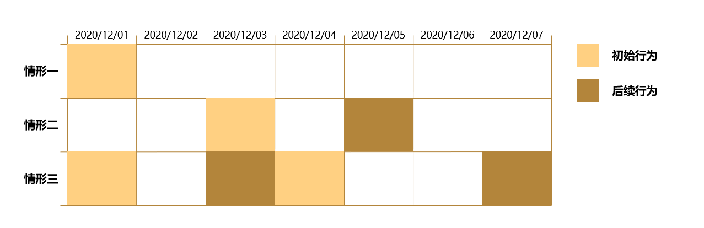

# 留存分析

## 留存分析界面概览

## 查询条件配置方法

### 配置初始行为及后续行为

留存分析的查询条件配置首先需要设置**初始行为**及**后续行为**，初始行为及后续行为的选择皆来源于**元事件**：


初始行为：判断留存的初始条件，只有触发了初始行为的用户才会纳入留存计算

后续行为：判断留存的后续条件，触发了初始行为之后触发后续行为的，视为留存用户


初始行为及后续行为可以选择**任意事件**以及**相同的事件**。

例如将初始行为设置为**注册**，后续行为设置为**任意事件**，此查询条件表示用户触发注册后的一段时间内，只要触发任意事件即视为留存用户。

或者将初始行为以及后续行为都设置为**支付订单**，此查询条件表示成功复购的用户视为留存用户。

### 初始行为或后续行为的事件属性筛选

点击**增加筛选**按钮，可以单独对初始行为或后续行为添加筛选条件，筛选的属性来源于其携带的事件属性与全部的用户属性，具体的筛选条件配置方法与计算逻辑可参考[筛选条件](../basic/filter.md)。


例如初始行为选择注册，需要筛选出**手机号注册**的用户，可以在起始行为后方点击增加筛选按钮，配置筛选条件：**注册方式-等于-手机号**。配置完成后执行查询，则只有手机号注册的用户才会纳入计算。


### 设置关联属性

在初始行为及后续行为设定区域的下方，点击**设置关联属性**按钮设置初始行为及后续行为之间的关联属性，例如要想知道某个商品的复购情况，需设置初始行为、后续行为都为**支付订单**，关联属性设置为**商品ID**，这样当用户两次支付的商品ID相同时才会被判断为留存用户，若两次支付的不是同一个商品，则不会被算作留存用户。

## 用户筛选

使用者可以使用用户筛选功能对参与计算的用户进行筛选，用户属性的筛选结构为**用户属性-逻辑运算关系-属性值**，通过用户属性的筛选，我们可以针对某个特定的用户群体进行分析，例如选择**城市**等于**北京市**，那么将会对北京市的用户进行针对性的留存分析，多个用户属性之间可以选择**逻辑关系**，详情参见[筛选条件](../basic/filter.md)。


用户筛选过程先于留存模型计算，即先将选定用户群根据筛选条件进行筛选，然后以筛选后的用户群为基础进行留存计算


## 分析指标

分析指标指的是留存模型计算展示的结果，可以选择**留存用户**或者**流失用户**：


留存用户：在一段时间内，触发设定的初始行为之后触发了后续行为的用户，称为留存用户。

流失用户：在一段时间内，触发设定的初始行为之后没有触发后续行为的用户，称为流失用户，没有触发初始行为的用户不属于流失用户，也不属于留存用户，其群体不会被纳入查询统计中。


选定分析指标后执行查询，查询结果将按照选定的分析指标进行展示。

## 分析维度

.gif>)

默认按照**初始行为日期**维度展开，每一行展示当日的触发初始行为的用户数以及后续的留存情况。租户也可以选择按照**初始事件属性**或**后续事件属性**来细化展示维度，例如按照**城市**属性进行细化维度展示，可以查看不同城市的用户留存情况。


在分析指标选择留存用户的情况下，选择同时显示某事件的某属性指标后，将不能自行选择分析维度，只能按默认的初始行为日期来展开



当您已经设置了初始行为及后续行为得关联属性之后，分析维度将被禁用


## 分析用户群

.gif>)

点击分析用户群下拉框，可以选择需要分析的特定用户群，此下拉框内的可选项来源于已经创建完成的用户分群，如何创建用户分群请参考[用户分群](../userdivision.md)。


当选择了两个及两个以上的用户群进行对比分析时，分析维度选项将被禁用


## 留存分析图表查看

留存分析图表位于页面的右侧，配置完成查询条件后执行查询即展现数据。

* 折线图

上方的折线图，表示**留存用户/留存率**或者**流失用户/流失率**随时间的变动趋势，租户可以点击上方的**显示内容切换**按钮，切换折线图纵轴的展示数据标准。

点击图表上方的**显示数目**切换按钮，可以调整图表的展示数量，目前共有五个选项可以选择，分别是：前5项，前10项，前20项，前30项，前50项。

* 数据表格

下方的数据表格，表示**留存**或**流失**的详细数据表格，租户可以点击**显示占比**复选框，切换留存率/流失率在数据表格中的展现与否。

点击数据表格上方的留存标准切换按钮，可以选择**次日留存**，**7日留存**或**14日留存**三种留存标准，选择留存标准后，数据表格将根据留存标准实时展现数据。

## 时间范围选择

点击图表展示区左侧的**时间范围选择器**，可以选择查询的数据时间范围。关于时间范围选择的详细信息请参考[时间范围](../basic/timerange.md)。

## 保存书签

点击**保存**按钮后，可以将此次配置的查询条件保存为书签：


书签名称：必填项，该书签的名称。

同时添加至数据看板：可选项，选择具体的数据看板后，此次配置的查询条件将保存为书签同时在选择的数据看板内展示。如此选项留空，则只会保存为书签，后续可在书签管理模块管理此书签。


## 数据下载

数据分析工作台支持将数据下载至本地进行二次应用，点击**下载**按钮后，查询得到的数据将以csv的格式下载至本地，下载进度可以在页面上方的消息中心查看。

## 留存分析计算方法

### 留存用户

在上方的示例图中，黄色表示起始行为，棕色表示后续行为：


情形一：用户在12/01日触发初始行为，12/02触发后续行为，间隔时间为1天，此用户将被归为第一日的留存用户

情形二：用户在12/03日触发初始行为，12/05触发后续行为，间隔时间为2天，此用户将被归为第二日的留存用户

情形三：用户在12/06日触发了初始行为及后续行为，间隔时间小于1天，此用户将被归为当日的留存用户


### 流失用户

在上方的示例图中，黄色表示起始行为，棕色表示后续行为：


情形一：用户在12/01日触发了初始行为，后续没有触发后续行为，此用户将被归为连续1日，连续2日，连续3日，连续4日，连续5日，连续6日的流失用户

情形二：用户在12/03日触发了初始行为，12/05触发后续行为，间隔时间为2天，此用户将被归为连续1日的流失用户，且会被归为第二日的留存用户

情形三：用户在12/01日触发了初始行为，12/03触发了后续行为，之后再12/04触发了初始行为，12/07触发了后续行为，间隔时间分别为2天与3天，此用户将被归为连续1日的流失用户，且会被归为第二日，第三日的留存用户

