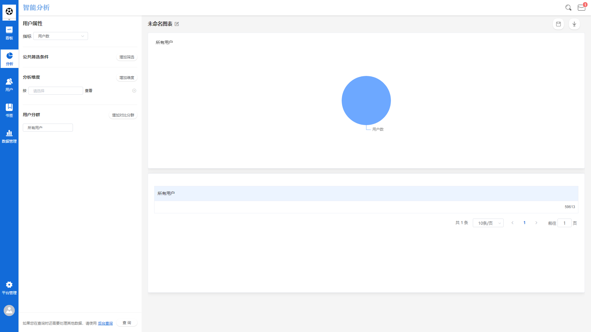

# 用户分析

用户分析，即以用户属性为分析维度，查看自有用户群体构成的分析模块。

## 用户分析界面概览

## 查询条件配置方法

### 指标配置

.gif>)

用户分析模块中，所有可选择的指标皆来自于用户属性，默认指标为用户数。同时，根据用户属性数据类型的不同，还可以选择其他用户属性的去重数、总和、最大值、最小值以及均值作为指标，指标只能选择一个。​

| 用户属性数据类型 | 可选指标 |
| -------- | ---- |
| 数值类型     | 总和   |
| 数值类型     | 最大值  |
| 数值类型     | 最小值  |
| 数值类型     | 均值   |
| 数值类型     | 去重数  |
| 日期时间类型   | 去重数  |
| 布尔类型     | 去重数  |
| 字符串类型    | 去重数  |


用户数：所有用户数

总和：对此属性的属性值求和

最大值：取此属性所有值中的最大值

最小值：取此属性所有值中的最小值

均值：计算此属性所有值的算术平均值

去重数：对此属性的所有值进行去重后留下的独立属性值个数


## 公共筛选条件

.gif>)

用户分析中的公共筛选条件是对所选择的指标进行筛选，具体的筛选条件计算规则请参考[筛选条件](../basic/filter.md)。

## 分析维度

.gif>)

选择分析维度后，用户分析的查询结果将按照维度值分组展示，维度可选项来源于全部的用户属性。

执行查询后，用户分析的结果图表将同时展示所有分组的数据，详细的分析维度规则请参考[分析维度](../basic/dimension.md)。

## 分析用户群

.gif>)

点击分析用户群下拉框，可以选择需要分析的特定用户群，此下拉框内的可选项来源于已经创建完成的用户分群，如何创建用户分群请参考[用户分群](../userdivision.md)。

## 保存书签

点击**保存**按钮后，可以将此次配置的查询条件保存为书签：


书签名称：必填项，该书签的名称。

同时添加至数据看板：可选项，选择具体的数据看板后，此次配置的查询条件将保存为书签同时在选择的数据看板内展示。如此选项留空，则只会保存为书签，后续可在书签管理模块管理此书签。


## 数据下载

智能分析平台支持将数据下载至本地进行二次应用，点击**下载**按钮后，查询得到的数据将以csv的格式下载至本地，下载进度可以在页面上方的消息中心查看。
