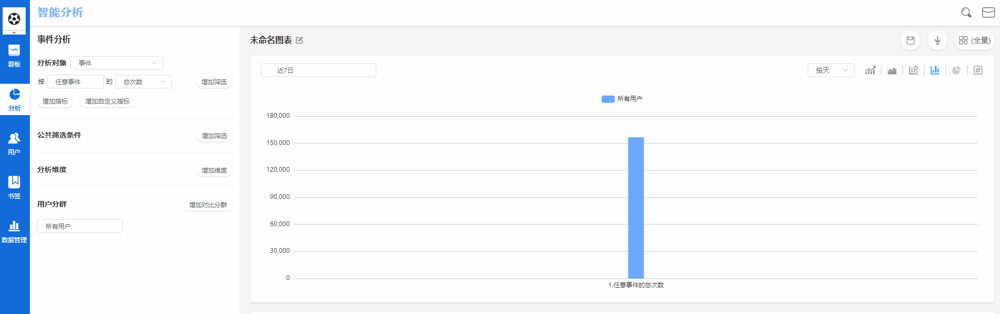

# 基础设置

## 基础设置界面概览

基本设置界面由两部分组成，上方为**展示功能区**，主要展示以下信息：


部署时间：数据分析工作台的部署时间。

到期时间：数据分析工作台的到期时间。

总事件量：数据分析工作台中的所有项目包含的事件量总和。

项目成员：数据分析工作台中的所有成员数量。

运行时长：数据分析工作台的运行时间长度。

元事件数量：当前项目中，包含的元事件数量总和。

埋点事件属性数量：当前项目中，所有的元事件携带的属性数量总和。

埋点用户属性数量：当前项目中，所有的用户属性数量总和。


下方为**导航功能区**，主要功能如下：

## 查看数据接入地址

在项目数据接入的初始时期，需要根据产品类型以及采集方式，选择合适的数据采集工具，此时点击**数据接入**按钮后，将进入数据接入功能页面，页面中展示全部的数据采集SDK以及使用教程。

您可以通过每个SDK后方设置的**获取下载地址**按钮，获取SDK的下载地址，如果您不清楚SDK的配置方法，可以点击**使用教程**按钮，获取SDK的使用教程。

## 数据入库验证

当产品数据接入数据分析工作台之后，您需要通过数据入库验证模块，验证已经入库的数据和《事件设计文档》是否一致。

数据入库验证模块主要验证以下四点：

（1）事件完整性

（2）属性完整性

（3）属性数据类型准确性

（4）存量数据中**空值**与**未知值**占比


数据入库验证需要校验全部存量数据，建议检验的频次不要过高，以免影响日常使用


## 设置发送邮箱

该功能主要用于监控预警规则时，发送告警通知的邮箱地址，如果您在此处配置了自定义的邮箱地址，当某个监控预警规则被触发时，将通过此邮箱发送告警通知。如果您没有在此处配置邮箱地址，当监控预警规则被触发时，将通过数据分析工作台的默认邮箱发送告警通知。
