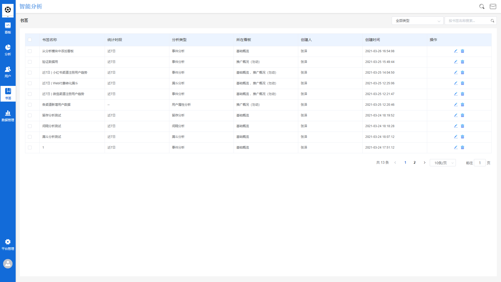
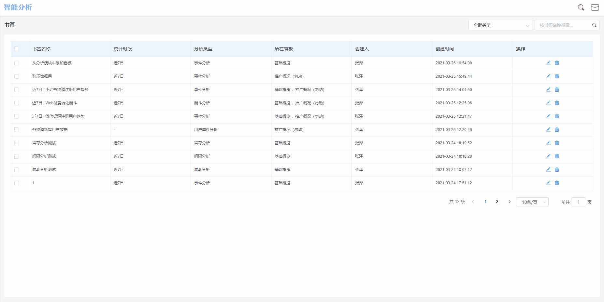
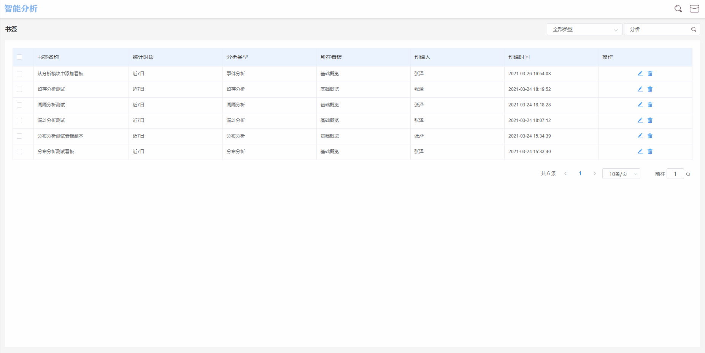

# 书签管理

## 书签的概念

在使用数据分析工作台的过程中，租户可以将查询配置条件进行保存，**保存后的查询配置条件**即为一个书签。

书签保存完成以后，统一在**书签管理**功能模块进行管理。保存完成的书签可以添加至任一已创建的看板中。

## 书签管理界面概览

书签管理界面主要由两部分组成，分别是左侧的**导航功能区**以及右侧的**展示功能区**，通过导航功能区，可以跳转至工作台的各个功能模块中，而展示功能区主要用来展示管理已经保存的书签。

## 界面各标签释义

书签管理界面主要包含**书签名称**，**统计时段**，**分析类型**，**所在看板**，**创建人**，**创建时间**六个标签，各标签所代表的含义如下：


书签名称：该书签在保存时编辑好的名称。

统计时段：该书签在保存时，选择的数据时间范围，如果保存时选择的是相对时间范围，将书签添加至看板时，该书签展现的数据会随着时间推移而更新；如果保存时选择的是绝对时间范围，将书签添加至看板时，展现的数据为该绝对时间范围内的数据，不会随着时间推移而更新。

分析类型：该书签保存时使用的分析模块。

所在看板：该书签现在所在的看板名称，如果书签未添加至任何看板，此处将展示未设置看板。

创建人：保存该书签的操作者账户名。

创建时间：该书签被创建时的时间点。


## 添加书签

在所有分析模块中，配置查询条件后执行查询，会得到相应的数据结果，此时点击分析模块的图表展示区右上角的**保存**按钮，将弹出书签保存弹窗：


书签名称：该书签的名称，例如“今日 | 新增用户数”

同时保存到看板：可选择同时将书签添加至一个或多个数据看板，也可以不选择直接留空。


编辑完成后，点击**确定**按钮，即可保存书签。

## 批量管理书签

在书签管理界面中，每一个书签的左侧都设有一个复选框，同时勾选两个以上的书签时，界面左上角将展现批量操作按钮：**添加到**，**删除**，**取消选择**。


添加到：将所有选择的书签添加至某个看板，点击此按钮后，可以选择需要保存至的看板，看板可以选择单个看板或多个看板。

删除：将所有选择的书签直接删除，为了防止误操作，选择删除后，工作台将弹出删除二次确认弹窗，点击确定后，所选择的书签将被删除。

取消选择：取消所有书签的选择状态。


## 书签的筛选与搜索

### 根据使用的分析模块筛选

如需要根据保存书签时使用的分析模块进行筛选，可以点击上方的分析模块下拉框，选择需要的分析模块后，展示功能区内将筛选出使用此分析模块保存的书签。如果选择后界面显示暂无数据，说明项目内未使用此分析模块保存书签。

### 搜索

在搜索输入框内输入书签名称，展示功能区将实时根据输入的内容进行筛选，如果输入后界面显示暂无数据，则说明没有书签名称包含当前输入的关键词。

## 书签的修改

在每个书签的右侧，都设有**修改书签**以及**删除**按钮：


修改书签：用以对已保存的书签名称及隶属看板进行修改，点击后将弹出修改看板弹窗，依次编辑各个编辑项，点击保存即可。

删除：为了防止误操作，选择删除后，工作台将弹出删除二次确认弹窗，点击确定后，此书签将被删除。

