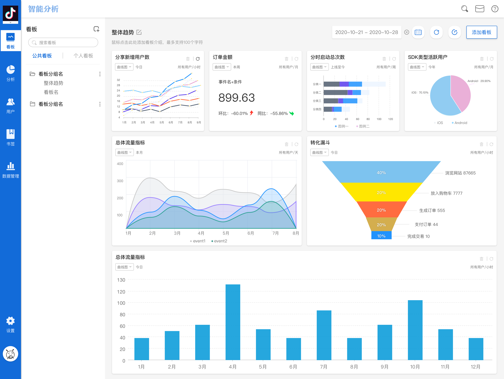
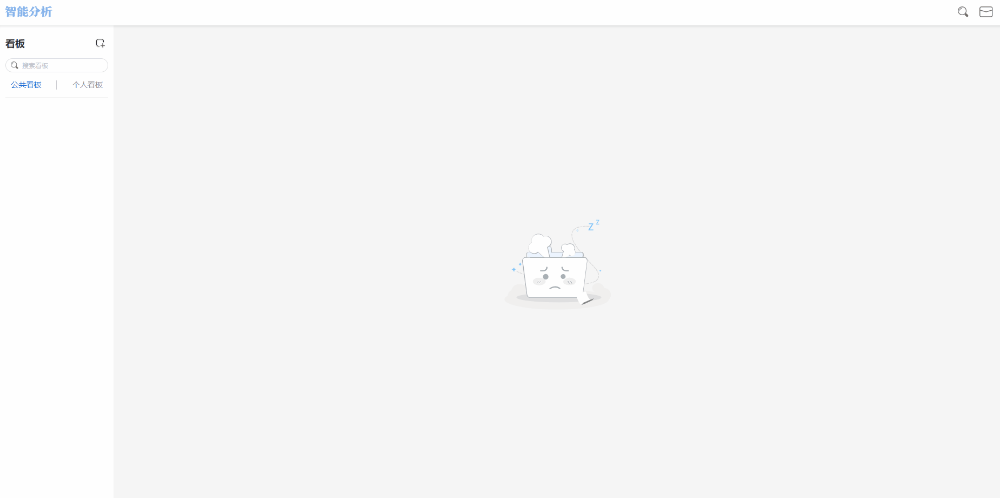
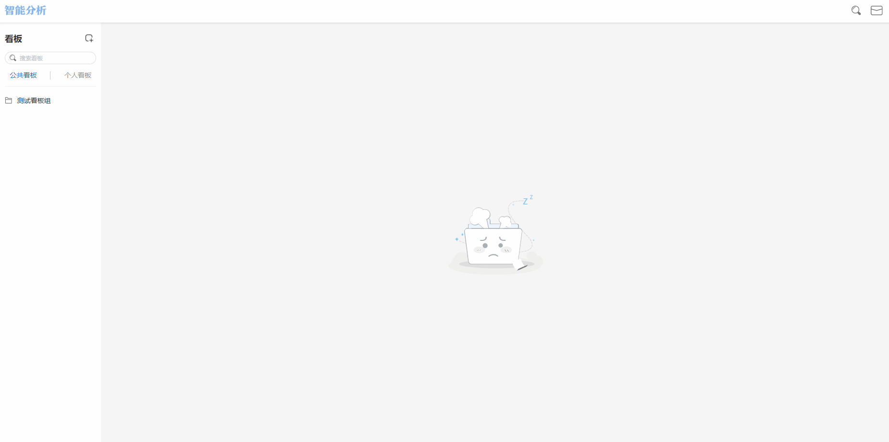
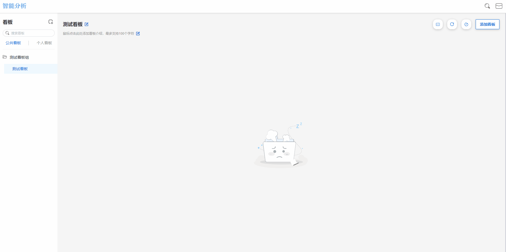
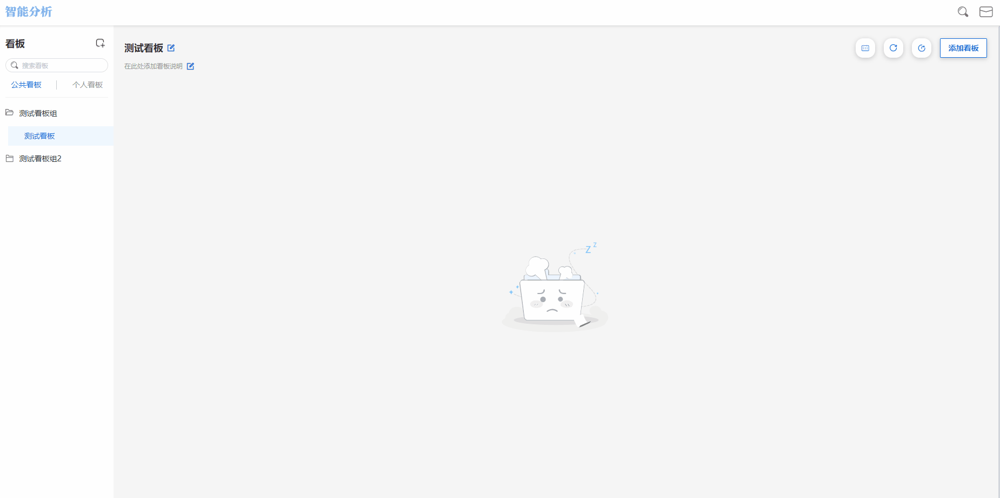
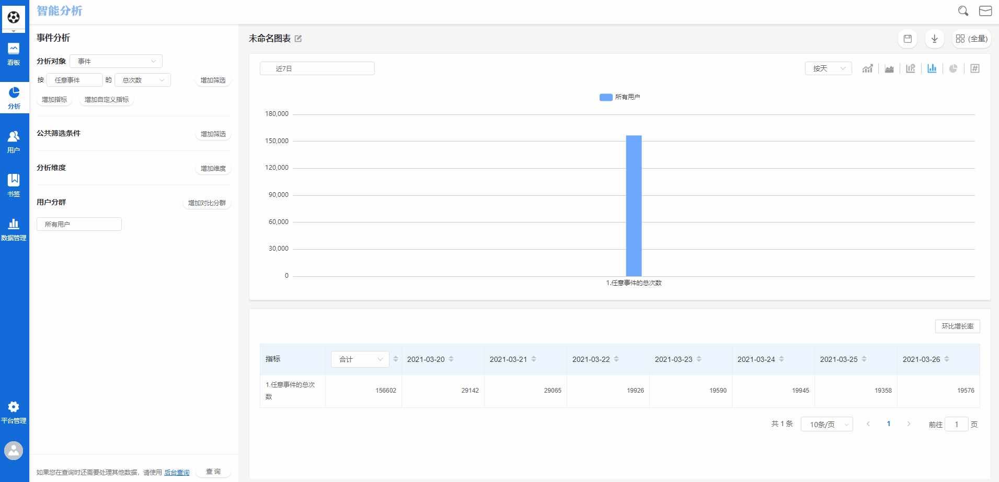
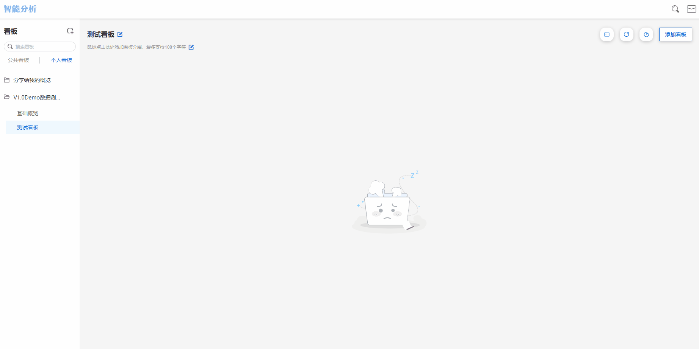
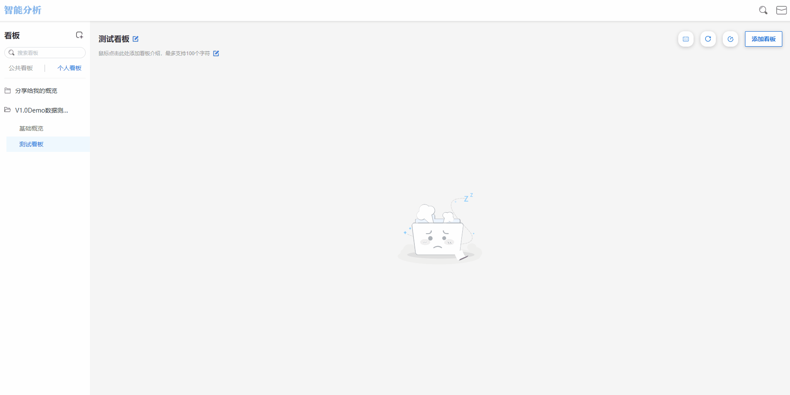
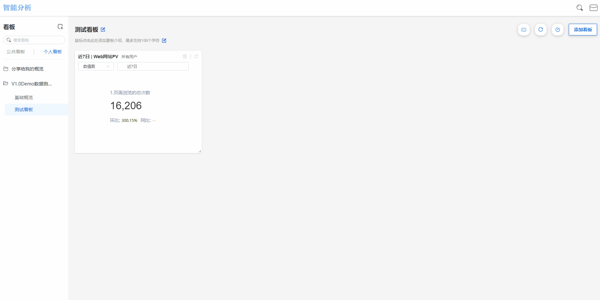

# 看板&看板组

看板，是数据可视化的最终载体。该模块支持10个高级分析模型分析结果的展示，不同角色均可将需要监测数据指标以[书签](bookmarks_management.md)的形式添加到看板中，构建自定义看板，以满足自身的数据追踪需求。

| 分析模块  | 是否支持将查询结果保存至看板展示 |
| ----- | ---------------- |
| 事件分析  | 是                |
| 分布分布  | 是                |
| 漏斗分析  | 是                |
| 留存分析  | 是                |
| 间隔分析  | 是                |
| 路径分析  | 否                |
| 用户分析  | 是                |
| 归因分析  | 是                |
| 渠道分析  | 否                |
| 热力图分析 | 否                |
| 自定义查询 | 否                |

看板的整体结构由三部分组成，分别是看板组>看板>书签，在创建看板时，需要首先创建看板组。

## 看板组的结构

看板组分为**公共看板**和**个人看板**两部分：


公共看板：需要共同关注的重要看板，由具有管理公共看板权限的人员共同维护。

个人看板：主要用于将操作者自己常用的分析结果保存起来，形成便于查看的数据看板，满足不同的分析需求。

在个人看板中，只会显示本账号创建的组与看板，以及其他人员分享给操作者的看板。同时，操作者创建的组与看板在其他人员的界面中也不会显示，除非操作者分享给其他成员。


## 看板组的相关操作

### 添加看板组

点击左侧看板导航区域下方加号按钮，选择**添加组**，输入组名，点击**确认**按钮即可添加看板组。

### 修改看板组名称

点击组名右侧“...”按钮，选择**修改组名**，输入新的组名，点击**确认**按钮。

### 删除看板组

点击左侧看板导航区域所在组的右侧“...”按钮，选择**删除组**，同时可选择是否删除组内看板，点击**确认**按钮。

## 看板相关操作

### 添加看板

### 修改看板名称

点击组内看板右侧“...”按钮，选择**修改名称**，输入新的看板名称，点击**确认**按钮即可完成看板名称的修改。

在看板主展示区的左上角也设有看板名称编辑按钮，点击**编辑**按钮，输入新的看板名称，点击输入框外任意空白处即可完成修改。

### 删除看板

.gif>)

点击组内看板右侧“...”按钮，选择**删除**，点击**确认**按钮即可删除看板。

### 添加看板说明

点击看板名称下方添加看板说明位置，输入看板说明，最多支持100个字符，编辑完成后点击任意空白区域即可。

### 移动看板分组

点击组内看板右侧“...”按钮，选择**移动至分组**，选择所要移入的分组，点击**确认**按钮即可将看板移动至需要的其他分组中。

### 看板共享设置

已经创建完成的看板可以共享给其他成员，分为两种情形：

#### 共享我的看板

如果想要共享**我的看板**分类中的看板，点击右上角的共享设置按钮后，有三个选项可以选择：


仅自己可见：此看板只有其创建者可见，其他所有成员不可见。

全部用户：此看板将分享至项目中所有成员的**分享给我的看板**分类中，项目中所有成员皆可见。

自定义：自由选择需要共享的成员。


#### 共享公共看板

共享**公共看板**分类中的看板同样有三个选项可以选择：


仅有管理公共看板权限的成员可见：此看板只有拥有公共看板管理权限的成员可见，其他所有成员不可见。

全部用户：此看板将分享至项目中所有成员的**分享给我的看板**分类中，项目中所有成员皆可见。

自定义：自由选择需要共享的成员。


## 添加书签至看板

### 从书签管理模块中添加

进入[书签管理模块](bookmarks_management.md)，找到目标书签后，点击书签后方的**编辑**按钮，在同时添加到以下看板一栏中，找到目标看板后点击勾选，点击确定后，此书签即添加至需要添加的看板中。

受限于操作流程中只能逐个对书签进行操作，所以此种添加方法更适合于少量看板变动时使用。

### 从分析模块中直接添加

在使用分析模块执行查询后，可以点击右上角的**保存**按钮，输入书签名称后，在同时添加至以下看板一栏中选择目标看板，点击**确定**按钮后，此次查询结果将保存为书签，同时该书签将同步添加至选择的看板中。

### 在看板界面批量添加

点击右上角添加看板按钮，可选择添加书签进看板，可从左侧全部书签列表中根据高级分析的名称进行筛选，也可从右侧自行输入名称查询，点击所要添加的书签名称右侧的复选框，点击确认按钮即可。

## 看板中书签的相关操作

### 切换时间范围

点击右上角最左侧的日历图标，选择所要查询的时间范围，由于同一个看板下涉及到多个图表，该板块支持的最小查询时间范围为一天。


此位置的时间范围切换会自动同步到看板下所有图表，但该条件勾选只支持单次查询，并不会保存，退出后再进入会自动恢复之前的时间范围设置。


### 刷新数据

#### 全部刷新

为了减少查看看板时数据加载的时间，看板内数据并不会时刻更新，而是增加了缓存。非本日数据，会在当天零点过后自动计算缓存；涉及到当日的数据，则会每10分钟计算缓存一次，如果想看到实时数据，可以点击刷新得到实时数据。

#### 单独刷新

鼠标移入看板中的某个书签时，右上角将展现刷新按钮，点击**刷新**按钮，此书签的数据将立即刷新。

### 查看书签查询条件

选择看板中的的目标书签，点击书签名称，即可进入书签详情页。

### 修改书签的尺寸与位置

将鼠标移动至书签右下角的**尺寸调节按钮**，按住鼠标左键后拖动即可改变图表大小。

如果想要调整书签的位置，可以将鼠标移动至要拖动的图表上，当鼠标变成“+”字符号时，按住鼠标左键后拖动书签即可改变书签位置，灵活配置个人看板。

### 删除书签

鼠标移入看板中的某个书签时，右上角将展现删除按钮，点击**删除**按钮，此书签将从当前看板中移除。


此处仅是将书签从看板中移除，并未删除此书签。如果不小心误操作，可通过页面右上角的添加看板按钮重新进行添加。若需要删除书签，可前往管理-书签列表中进行删除。

