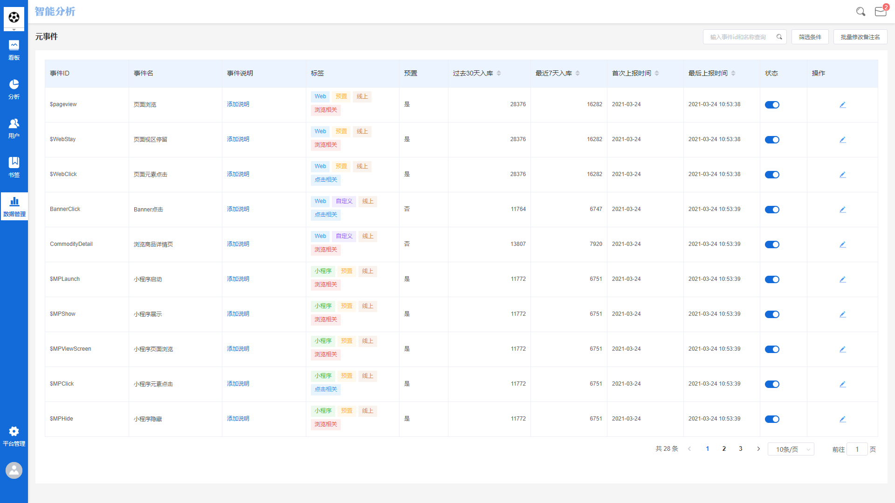
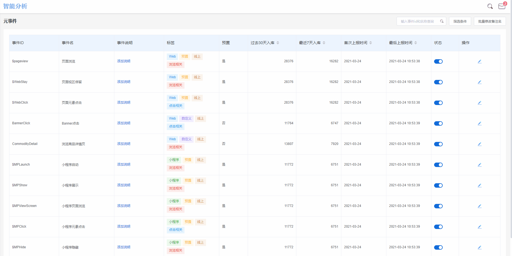
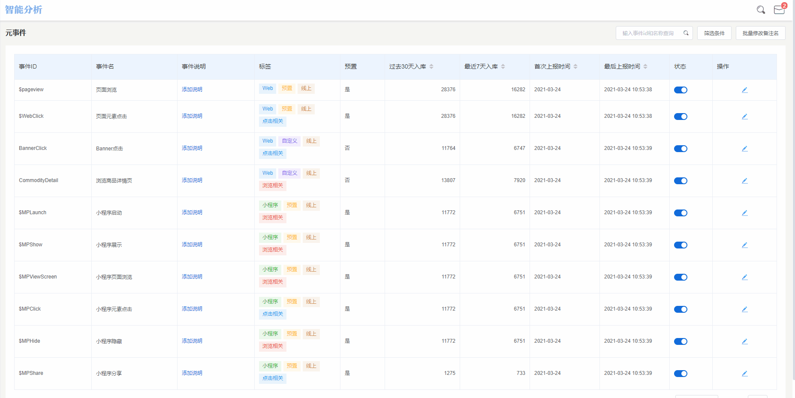

# 元事件管理

## 元事件管理界面概览

元事件管理模块主要分为两个功能区，左侧的**导航功能区**以及右侧的**管理功能区**，下面将以从进入元事件管理为起点，详细介绍各个标签代表的含义以及各功能的操作方法。

## 元事件的概念

在[事件](../basic/events.md)章节中，我们从业务的角度介绍了什么是事件，简单概况来说，为了满足分析场景需要的各种指标，我们设计了不同的事件采集不同的数据指标，这些不同的事件在数据分析工作台内，统称为元事件。以事件为主体来讲，我们可以将其理解为**全部用户所触发事件的去重集合**。

当项目处于**初始化**的状态时，**元事件管理**界面显示无数据，随着数据开始上报，所有设计好的事件将逐步出现在元事件管理界面中。

举例来说，某项目为了采集数据指标，设计了**App启动**，**点击首页Banner**，**提交订单**，**支付订单**，**App关闭**五个事件。当项目处于初始化状态时，元事件管理界面上显示无数据，接下来，数据开始接入，当用户启动集成了SDK的App时，触发了App启动事件的上报，此时该项目的元事件管理界面中将显示第一条元事件，即App启动事件，随着用户后续不断的使用App，所有设计好的事件将全部出现在元事件管理界面中。

## 进入元事件管理

元事件管理模块位于管理功能区内，可以在工作台上方导航栏处点击**管理-元数据管理**，然后在左侧的导航功能区处选择**元事件**。

## 界面各标签释义

元事件管理界面中共存在**事件ID**，**事件名**，**事件说明**，**标签**，**预置**，**过去30天入库**，**最近入库**，**首次上报时间**，**最后上报时间**，**状态**十个标签，各标签的含义如下：


事件ID：该事件在数据库内的标识，根据《事件设计文档》制定，需要符合标准变量名命名规范，即只包含大小写字母，数字，下划线，且非预置事件不能以$符号开头。

事件名：该事件用以展示的名称，可以根据实际的业务需求自定义名称。

事件说明：根据实际需求为事件编写的说明。

标签：根据实际需求为事件添加的标签，在对事件进行筛选时可以使用标签完成快捷筛选。

预置：表明该事件是否为预置事件。

过去30天入库：展示该事件过去30天入库的数据条数总和。

最近入库：展示该事件从首次上报至末次上报的数据条数总和。

首次上报时间：该事件数据首次上报至服务器时的时间点。

最后上报时间：该事件数据末次上报至服务器时的时间点。

状态：该事件的显示状态。


## 事件显示名的修改

### 单独修改

在**事件名**标签下一栏，展示事件的显示名，默认未修改的情况下，此处展示内容与**事件ID**一致，可以点击事件名，根据实际的业务需求进行修改，修改完成后，点击输入框外任意位置或键入回车即可保存修改的内容。

### 批量修改

当事件数量较多时，可以选择对事件名进行批量修改，点击**批量修改备注名**按钮，将弹出批量修改备注名弹窗，只需两个步骤即可完成事件名批量修改：

#### 下载修改模板

点击**下载模板**按钮后，模板即开始下载，下载完成的模板为文件名为【项目名称】-元事件批量修改备注名模板.xlsx的表格文件，表格共分为三列，从左至右分别为事件ID，事件显示名，事件说明。可以直接编辑事件显示名与事件说明两列，编辑完成后保存文件至方便寻找的位置。


事件ID一列不可更改，更改后将导致批量修改失败。


#### 上传已修改模板文件

点击**上传文件**按钮后，将弹出本地文件选择窗口，找到刚才保存好的模板文件后点击右下角**打开**按钮进行上传。

以上两个步骤完成后，点击批量修改备注名弹窗右下角的**确定**按钮，即可完成批量修改事件名的操作。

## 事件说明的添加与修改

### 单独修改

在**事件说明**标签下一栏，展示事件的事件说明，默认未修改的情况下，此处展示**添加说明**按钮，可以点击添加说明按钮添加事件说明，编辑完成后点击右下角**确定**按钮即可完成事件说明的修改。

### 批量修改

见上方事件名的批量修改过程。

## 事件标签的配置

在项目处于初始状态时，标签栏位下展示的全部为**未设置**字样，点击**添加标签**按钮后，标签列表为空白状态，此时需要先点击左下角**添加标签**按钮添加标签库。

点击添加标签按钮后，弹出添加标签弹窗：

### **勾选**继续添加复选框

当勾选继续添加复选框后，输入标签名称、选择标签颜色之后，点击右下角的**确定**按钮，将直接开始下一个标签的添加操作。

### **不勾选**继续添加复选框

当不勾选继续添加复选框后，输入标签名称、选择标签颜色之后，点击右下角的**确定**按钮，将直接完成标签添加流程。

在标签库中添加完成标签之后，在某个元事件的标签栏位下点击**添加标签**按钮，之前创建完成的标签将出现在标签选择列表中，勾选标签后点击右下角的确定按钮，即可为某个元事件添加标签。


标签库内的标签为所有元事件通用，在某个元事件后添加标签后，如果想要为其他元事件添加相同的标签，不需要重复创建，只需要勾选之前创建好的标签，点击确定即可。



假定某项目中存在三个元事件ABC，在初始状态时，为元事件A创建了标签“产品”，如果需要为元事件C同样赋予“产品”标签，此时可以在元事件C后的标签栏位下点击添加标签按钮，勾选“产品”标签即可。


## 选择事件显示状态

在每一个元事件的显示状态栏位下，都设有一个显示状态开关，开关共具有**开启**与**关闭**两种状态：


开启：该元事件正常出现在所有模块的事件选择器中。

关闭：该元事件从所有模块的事件选择器中隐藏，只会出现在元事件管理模块中。



元事件显示状态的开启与关闭不影响该事件的数据采集，只影响其在事件选择器的显示状态


## 元事件的编辑

点击某个元事件的操作按钮，将从页面右侧弹出元事件的编辑窗口，上半区展示该元事件的**事件名称**，**事件标签**，**事件说明**，**事件显示状态**，其编辑方法、编辑逻辑与上方相同，此处不做赘述。

下半区展示该元事件所携带的所有属性，同时此处可以对**属性显示状态**进行修改：

### 属性显示状态


开启：该属性正常出现在所有模块的属性选择器中。

关闭：该属性从所有模块的属性选择器中隐藏。



属性的显示状态不影响该属性的数据采集，只影响其在属性选择器的显示状态


## 搜索与筛选

当元事件数量较多时，可以对元事件进行搜索或筛选：

### 搜索

在元事件管理界面上方设有搜索栏，可以在搜索栏中输入事件ID或事件显示名称进行搜索，搜索结果将实时展示在界面下方，当搜索无数据时界面展示暂无数据。

### 筛选

在元事件管理界面上方设有筛选按钮，点击筛选按钮后将弹出筛选条件配置窗口，可以从**埋点平台**，**标签**，**是否预置**，**显示状态**四种维度下对所有元事件进行筛选。

点击筛选条件配置窗口右上角的**清除筛选**按钮后，将清空筛选条件，界面上展示全部元事件。

## 展示数量限制

默认情况下，元事件管理界面每页展示10条元事件，点击**单页展示数量切换**按钮，可以选择每页展示的元事件数量。
