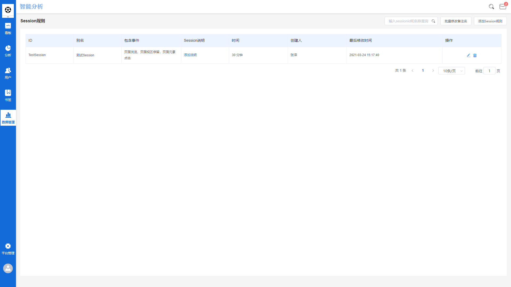
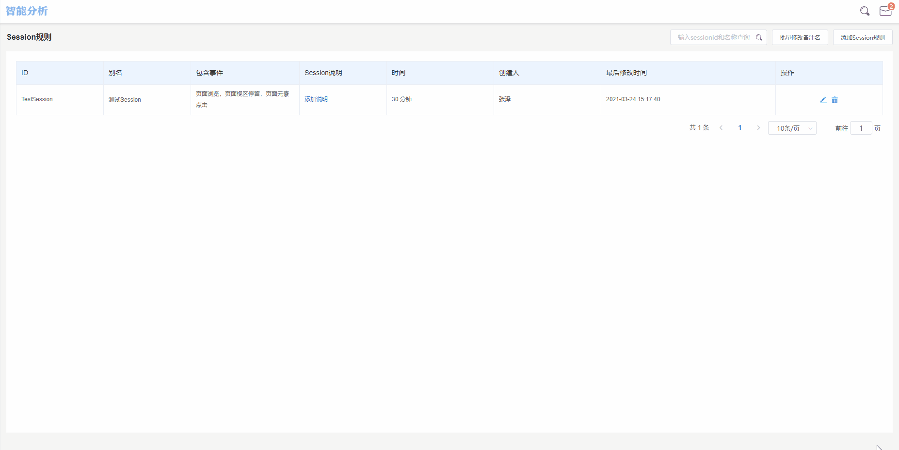
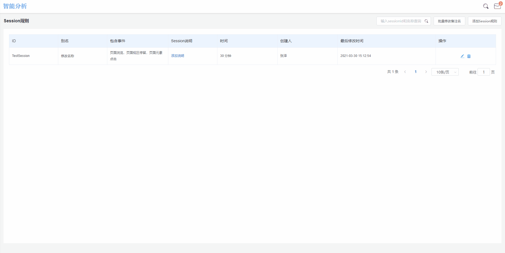

# Session管理

## Session管理界面概览

Session管理界面由两部分组成，分别为左侧的**导航功能区**以及右侧的**展示功能区**，下面将以进入Session管理界面为起点，介绍如何管理已创建的Session规则以及添加新的Session规则。

## 进入Session管理

Session管理功能模块位于**管理-元数据管理**中，在工作台上方主导航栏点击**管理-元数据管理**，在左侧导航功能区选择Session管理即可进入Session管理界面。

## 各标签释义

Session管理界面设有**Session ID**，**Session显示名称**，**Session包含事件**，**Session说明**，**切割时间**，**Session创建人**，**最后修改时间**共七个标签。


Session ID：该Session在数据库内的唯一标识。

Session显示名称：该Session在工作台界面中的显示名称。

Session包含事件：该Session规则的组成事件列表。

Session说明：用以对该Session进行介绍的说明性文本。

切割时间：该Session规则的切割时间规则。

创建人：该Session规则的创建者账户名。

最后修改时间：该Session规则最后一次修改生效的时间节点。


## 修改Session显示名称

点击Session显示名称旁的编辑按钮，即可对Session显示名称进行编辑，编辑完成后，点击输入框外任意位置或键入回车即可保存修改结果。

## 添加Session规则

点击Session管理页面右上角的**添加Session规则**按钮，页面右侧将弹出Session创建配置窗口，共有五个编辑项需要配置：

### 编辑Session ID

该Session在数据库内的唯一标识，命名时需要符合标准变量名的命名规范，即只包含大小写字母、数字及下划线，同时需要注意Session ID不能以$符号开头。

### Session显示名称

该Session在工作台界面中的显示名称，可根据业务需求自由命名。

### Session说明

用以对该Session进行介绍的说明性文本，**非必填项**。

### 切割时间

Session查询时的切割时间长度，可以选择**小时**，**分钟**，**秒**三种单位。

切割时间的配置需要根据具体的业务环境来决定，例如产品类型为Web网站，用户浏览一个页面时间的时间较长，此时如果切割时间设置过短，会导致Session数量上升，Session时长缩短，数据结果失去参考价值。

### Session组成

组成该Session的事件，点击**添加事件**按钮后，从事件选择下拉框中选择需要的事件即可为该Session规则添加组成事件。

Session组成事件可以分为两种情况：

#### 选择**任意事件**

如果选择任意事件作为Session的组成事件，那么该Session规则内将包含全部元事件。

#### 选择**某个具体元事件**

如果选择数个元事件作为Session的组成事件，那么该Session规则内只包含选择的事件，不包含未选择的事件。

## 搜索

Session管理界面上方设有搜索框，在搜索框内输入**Session ID**或**Session显示名称**即可搜索，如搜索后无结果，界面上将展示暂无数据。
