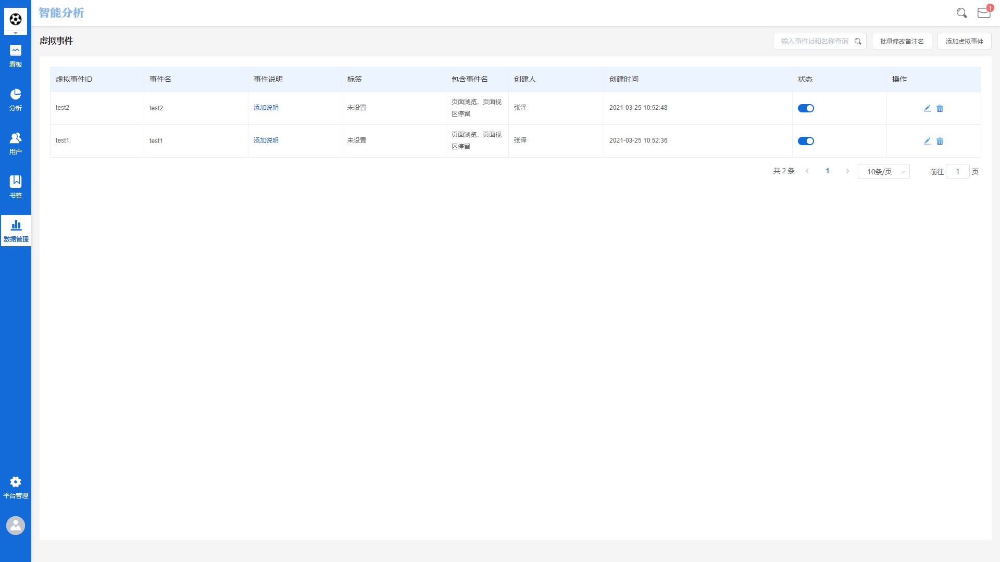
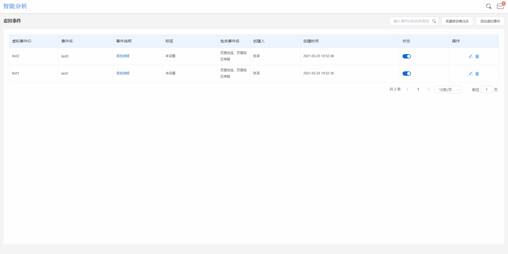

# 虚拟事件

## 虚拟事件的概念

虚拟事件指的是以现有元事件为基础，使用一定的逻辑条件，组合而成的一个新事件。虚拟事件主要为了提升在特殊业务环境下的操作便利性。


虚拟事件不属于元事件，不存在于元事件列表中


例如在开启了全埋点的情况下，用户在产品上的所有点击操作都会被SDK采集上报，如果此时想要看所有运营栏位的点击情况，需要以运营栏位的名称为筛选条件，从所有点击数据中筛选出运营栏位的点击数据：

**App元素点击-总次数；筛选条件-元素内容-包含-今日推荐；猜你喜欢；首页banner**

如果此时需要进行**运营栏位点击-支付订单**的漏斗分析，那么就需要在漏斗分析模型中重新配置一遍查询条件，操作十分繁琐。

此时可以借助虚拟事件解决这类问题，将上方的查询条件配置为虚拟事件，命名为运营栏位点击，后续可以直接在事件选择器中选择**运营栏位点击**事件进行查询。

## 界面各标签释义



虚拟事件管理界面包含**虚拟事件ID**，**虚拟事件显示名**，**虚拟事件说明**，**标签**，**包含事件**，**创建人**，**最后修改时间**，**显示状态**共七个标签：


虚拟时间ID：创建虚拟事件时编辑的虚拟事件ID。

虚拟事件显示名：创建虚拟事件时编辑的虚拟事件显示名。

虚拟事件说明：创建虚拟事件时编辑的虚拟事件说明。

标签：创建虚拟事件时勾选的标签。

包含事件：该虚拟事件的所有组成事件的事件显示名。

创建人：该虚拟事件创建者的账户名称。

最后修改时间：该虚拟事件最后编辑保存时的时间点。

显示状态：该虚拟事件的显示状态为开启或关闭。


## 虚拟事件的创建方法



点击虚拟事件管理界面的右上角的**添加虚拟事件**按钮，将弹出虚拟事件创建窗口，在该窗口中需要设置以下项目：

### 虚拟事件ID

虚拟事件ID与事件ID逻辑相同，为虚拟事件在数据库中的唯一标识。虚拟事件ID的命名规则需要符合标准变量名命名规范，即只包含大小写字母，数字，下划线。


虚拟事件ID不能以$符号开头


### 虚拟事件显示名称

业务上的显示名称，创建时可以根据业务的实际需求自由命名。

### 分类标签

点击分类标签文本框，勾选需要添加的标签后，点击右下角的**确定**按钮，分类标签即添加完成。

如果之前未创建过标签，此时点击分类标签文本框，标签选择窗将为空白状态，此时需要先点击左下角的**添加标签**按钮创建一个新标签，输入标签内容，选择标签代表色后点击**确定**按钮，此时一个新标签创建完成，重新点击分类标签文本框，标签选择窗将展示之前创建的标签，勾选后点击确定即可。

### 虚拟事件说明

该虚拟事件的说明性文本，租户可根据实际需求自由编辑。

### 虚拟事件组成

点击**增加事件**按钮后，按钮下方将展开事件选择器，点击下拉按钮即可选择虚拟事件的第一个组成事件。

以此类推，根据实际需要逐个将虚拟事件所需的事件添加完成，虚拟事件的组成事件即添加完成。

在选择虚拟事件的组成事件时，所有选项来源于元事件，无法选择元事件中不包含的事件作为组成事件。

### 虚拟事件组成事件的筛选条件

每个虚拟事件组成事件的后方，都设有一个**添加筛选**按钮，点击后，即可为该组成事件添加筛选条件，有关筛选条件的逻辑计算方法，请参考[筛选条件](../basic/filter.md)。

以上**六项**内容设置完成之后，点击右下角的确定按钮，虚拟事件即创建完成。之后在其他模块的事件选择器中可以选择创建完成的虚拟事件。

### 虚拟事件显示名称的修改

对于虚拟事件显示名称的修改，可以参考[元事件管理](events_management.md)中的事件显示名称修改。

### 事件说明的添加与修改

对于虚拟事件说明的添加与修改，可以参考[元事件管理](events_management.md)中的事件说明修改。

### 虚拟事件标签的添加与修改

对于虚拟事件标签的添加与修改，可以参考[元事件管理](events_management.md)中的事件标签添加与修改。

### 修改虚拟事件组成事件与筛选条件

如果需要对已经创建的虚拟事件进行编辑修改，可以点击虚拟事件后方操作标签栏位下的**编辑**按钮，点击该按钮后，界面右侧将弹出虚拟事件的编辑窗口，具体编辑项目与创建虚拟事件时的编辑项目一致，修改后点击右下角的**确定**按钮即可。

### 删除虚拟事件

如果需要删除某个已经创建完成的虚拟事件，可以点击虚拟事件后方操作栏位下的**删除**按钮，为了防止误操作，点击删除按钮后，将弹出删除的二次确认弹窗，点击弹窗中的**确定**按钮后，该虚拟事件将会被删除。

### 虚拟事件的显示状态

在每一个虚拟事件的显示状态栏位下，都设有一个显示状态开关，开关共具有**开启**与**关闭**两种状态：


开启：该虚拟事件正常出现在所有模块的事件选择器中。

关闭：该虚拟事件从所有模块的事件选择器中隐藏，只会出现在虚拟事件管理模块中。


虚拟事件显示状态的开启与关闭不影响该虚拟事件的数据采集，也不影响其组成事件的数据采集，只影响其在事件选择器的显示状态。

## 业务实例

### 背景介绍

某企业主营业务为电商，拥有官网以及移动APP两种用户触达终端，用户可以自由选择在哪个终端浏览商品或下单。

企业接入了数据分析工作台以后，发现在官网上，所有页面的浏览事件都是**页面浏览**事件，如果想要单独查询部分页面的浏览数据 ，可以通过配置筛选条件来实现，但是这种实现方式存在一个弊端，那就是如果再次查询，需要重新配置一遍筛选条件，效率较低。

### 需求理解

用户在浏览Web端网站时，每浏览一个页面，都会上报一个**页面浏览**事件，事件会携带一定量的属性来描述用户此次页面浏览事件浏览的是哪个页面，例如：

```javascript
{
     "distinct_id":"12345",
     "time":1608620370,
     "project":"zall_data",
     "type":"track",
     "event":"$pageview",
     "properties":{
         "$title":"最新款ABC手机",
         "$url":"http://www.zalldata.com/goods/ABC/ABC 30",
         "$url_path":"goods/ABC/ABC 30",
         "item_name":"ABC 30",
     }
 }
```

当用户浏览了一个页面时，会上报如上所示的一条数据，该条数据表示，**用户ID**为12345的用户，在时间戳为1608620370的时间点，触发了**页面浏览**事件，其浏览的页面地址为$url字段所携带的值。

根据用户浏览页面的不同，**页面标题**也有所不同，如果想要分析所有ABC商品页面的浏览数据，在分析时可以配置筛选条件，令**页面标题-包含-ABC**。

到这里就发现了问题中存在的弊端：

（1）再次查询时需要再配置一遍筛选条件。

（2）如果筛选条件复杂，那么每次都要耗费大量的时间进行配置。

### 问题解决

此时我们可以通过虚拟事件功能模块解决这个问题，比如企业某次促销活动主要涉及**手机**，**日用品**，**电脑**，**鞋子**四类商品，那么虚拟事件的配置条件如下：


虚拟事件ID：goods_promotion

虚拟事件显示名称：商品促销页面浏览

虚拟事件组成：

A.事件：页面浏览

B.筛选条件：页面标题-等于-手机/日用品/电脑/鞋子


虚拟事件创建完成之后，我们可以在**事件分析**模块中，使用此次新建的虚拟事件为查询主体，例如查询**商品促销页面浏览**的总次数，我们就可以获悉包含了促销品类的所有页面的浏览次数，之后还可以根据分析维度进行下钻，例如按照**商品名称**进行下钻，就可以获得此次促销活动中，不同商品的浏览相关数据。
