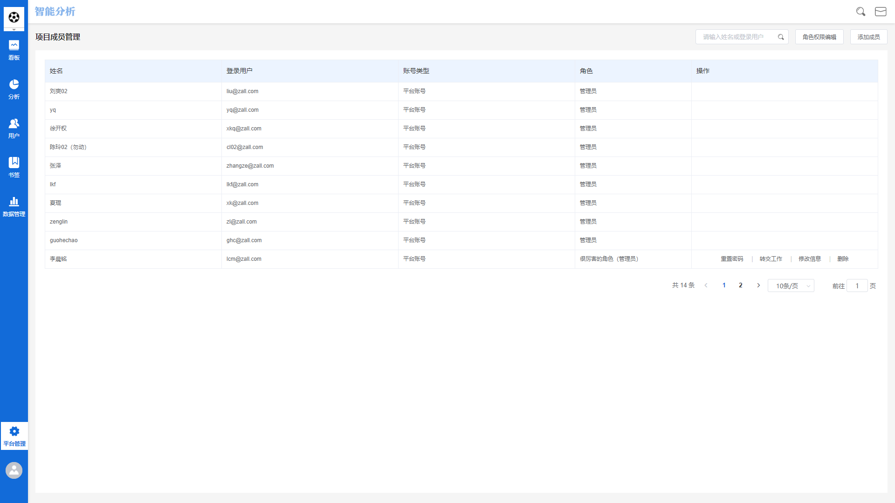
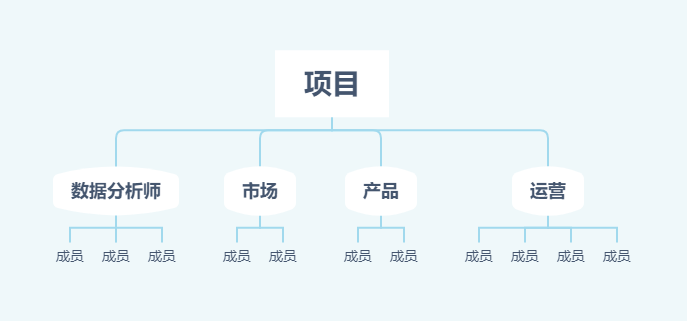
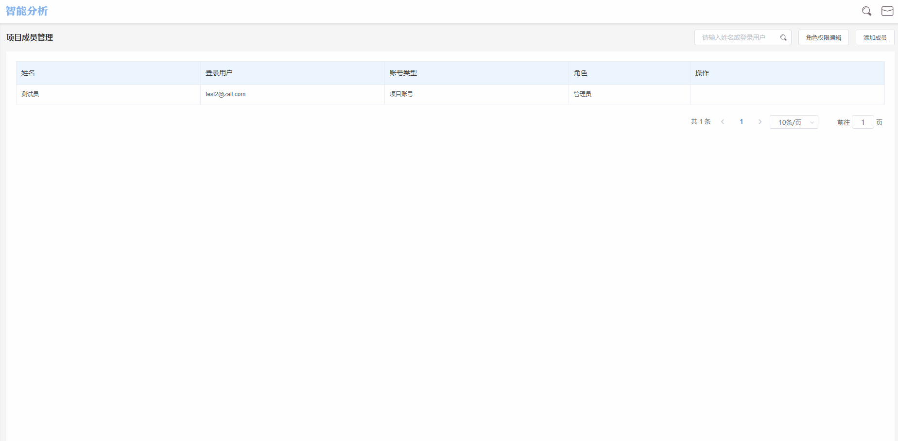
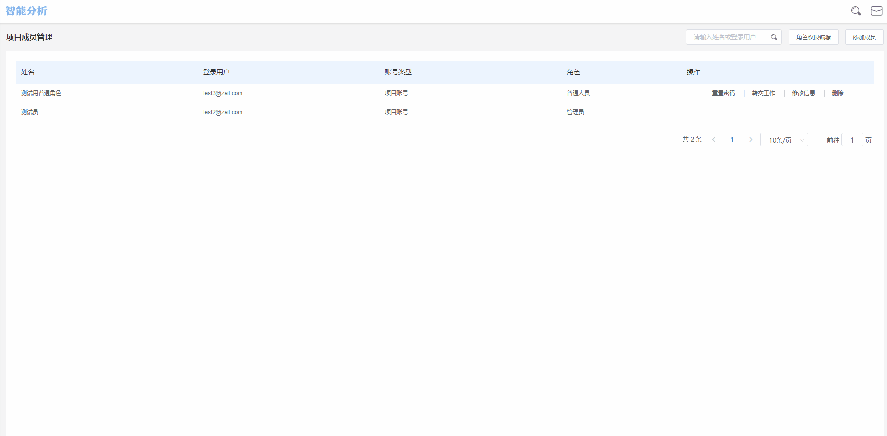
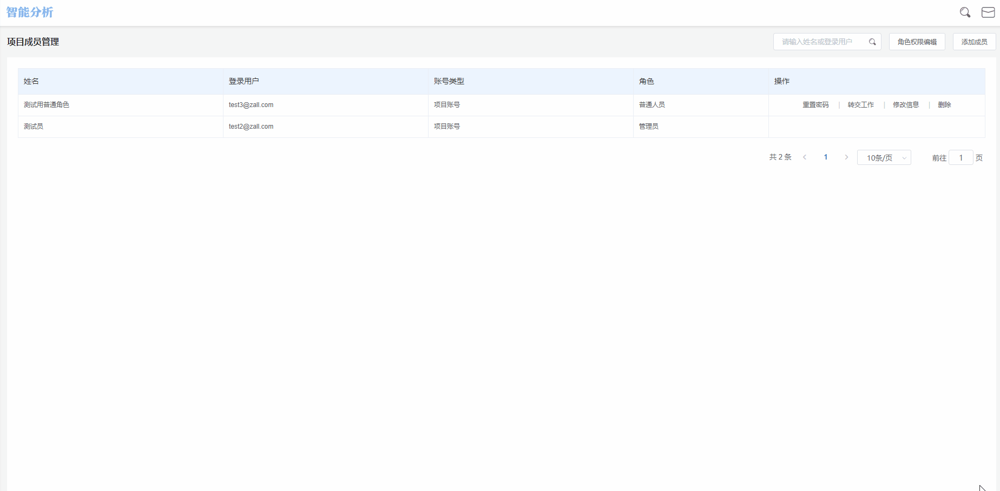
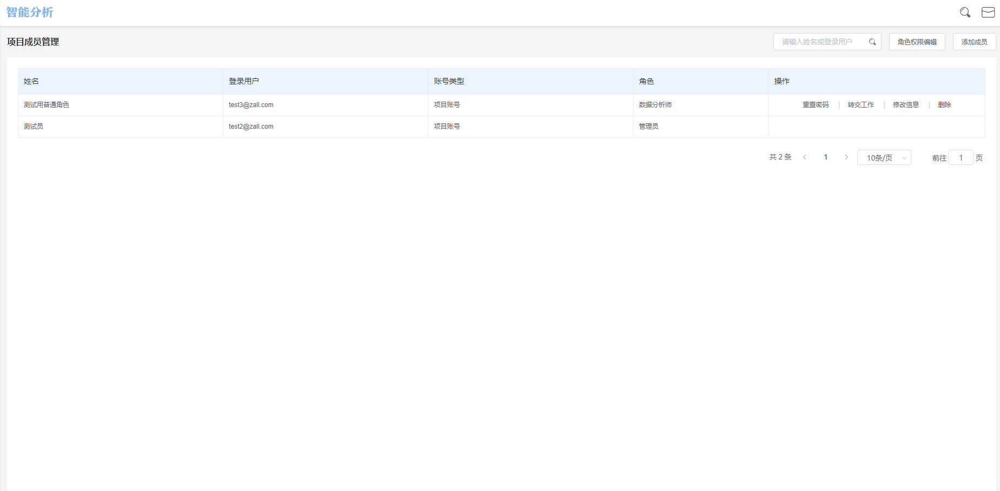

# 成员与权限

## 成员与权限界面概览

## 成员与角色的概念

在数据分析工作台中，**成员**与**角色**的概念有所不同，我们可以用现实中**姓名**与**职位**的关系来理解成员与角色的区别：


成员：成员是独立的，每个成员分配一个账户，例如项目中的张某某，李某某。

角色：角色不是独立的，多个成员可以同属一个角色，例如数据分析师，管理员。


在一个数据分析项目中，成员与角色的关系为项目>角色>成员。

通过**成员与权限**模块，管理员可以为不同成员进行角色赋予、权限配置等一系列操作，以便企业内部不同角色成员均参与到数据分析与决策的过程中来，同时也方便对所有项目成员进行统一的管理。

## 成员

### 成员账户类型的区别

数据分析工作台的账户共有两种类型，分别是**平台账户**以及**项目账户**：


平台账户：拥有多个项目授权的账户称为平台账户。

项目账户：只拥有单项目授权的账户称为项目账户，一个项目账户获得除本项目外任一项目授权，则自动转化为平台账户。


### 为项目添加成员

管理员在为项目添加成员时，可以通过以下两种方法实现：

#### 新建账户

主要针对没有平台账号的用户。点击页面右上角**添加成员**按钮，选择**新建账户**，在新建账户弹窗中共有以下六个编辑项：


姓名：该成员的姓名

登陆账号：登录账号需要为邮箱格式

登陆密码：6-18位字符，由数字及字母组成

成员角色：为此成员分配的角色，可单选或多选

手机号：此成员的手机号码

职务名称：此成员的职务名称。职务名称可以从已有职务中勾选或自行添加，添加职务后，该职务会在该项目中显示，若该成员还获得其他项目授权，在其他项目中不会显示该职务名称。


编辑完成后，点击**确定**按钮，即可在当前项目中创建一个新成员。

如果需要新建多个账户，可以在输入当前帐号信息后勾选**提交后，继续新增成员**复选框，点击确定后将立即开始创建下一个成员账户。

#### 邀请平台成员

选择邀请平台成员时，只能邀请该项目以外的成员，也就是已有平台账号，但未获得该项目授权的用户。点击页面右上角**添加成员**按钮，选择**邀请平台成员**，下拉寻找成员，或者输入名称、帐号查询到该用户，选择**邀请成员**，为其分配角色，选择职务名称，点击**确认**按钮即可。


新建账号时，若平台检测到该用户在其他项目中已有帐号，我们可直接邀请该成员加入本项目


## 成员的编辑操作

在项目所有成员列表页，我们可以根据需要对具体成员进行相关操作。

### 重置密码

若某一成员忘记密码或是想要更换密码，找到该成员，点击该成员右侧的**重置密码**按钮，输入新的密码，点击**确认重置**即可。

### 转交工作

若某一成员离职，或因需要更换项目，可以对其工作进行转交。点击该成员右侧的**转交工作**按钮，选择要转交的成员，确认即可。

工作转交操作完成后，被转交账户的所有角色权限及创建的看板，书签都会被转交。

需要注意的是，对不同**角色**成员进行工作转交时，可选择的成员有所不同：

对**平台管理员**进行工作转交操作时，可以选择平台内全部成员的任意一个进行转交。

对**项目管理员**进行工作转交操作时，只可以选择该项目内成员的任意一个进行转交。

对**其他角色**进行工作转交操作时，只可以选择该项目内成员的任意一个进行转交。

### 修改信息

点击某一成员右侧的**修改信息**按钮，可以重新设置该成员的**姓名，角色，手机号，职务**信息。

### 删除成员

若需要将某一用户从项目中删除，可以删除该成员。点击该成员最右侧的**删除**按钮，若该成员创建过看板、书签，在删除前需要先将其工作进行转交方可删除；若该成员未创建任何看板或书签，可直接进行删除。

## 角色

### 预置角色

数据分析工作台内部预置了常用的角色，不同角色对应不同的权限，管理员可以根据需要为不同的成员分配角色，各个预置角色的权限详情如下表所示：

| 角色    | 看板/书签    | 高级分析             | 用户分群     | 元数据管理  | 预警监控 | 渠道管理 | 成员与权限      |
| ----- | -------- | ---------------- | -------- | ------ | ---- | ---- | ---------- |
| 管理员   | √        | √                | √        | √      | √    | √    | √          |
| 数据分析师 | √        | √                | √        | √      | √    | √    | 仅查看成员与权限列表 |
| 产品    | 仅浏览看板和书签 | 仅部分高级分析          | 仅新建、查看分群 | 仅元数据查看 | —    | √    | 仅查看成员与权限列表 |
| 运营    | 仅浏览看板和书签 | 仅数据结果导出、自定义查询无权限 | 仅新建、查看分群 | 仅元数据查看 | √    | √    | —          |
| 普通人员  | 仅浏览看板和书签 | 仅保存到书签/看板，及事件分析  | 仅新建、查看分群 | —      | —    | —    | —          |

预置角色的权限配置无法修改。

### 新建角色

* 直接新建角色

当预置角色的权限配置无法满足业务需求时，可以通过新建角色的方法个性化配置权限，点击权限编辑页面右上角**新建角色**按钮，输入新的角色名称，在权限列表中勾选需要授权的权限，而后点击**保存**按钮即可。

可选的权限详细列表如下表所示：​

| 模块    | 相关操作      | 详细说明                                           | 项目管理员 | 数据分析师 | 产品人员 | 运营人员 | 普通成员 |
| ----- | --------- | ---------------------------------------------- | ----- | ----- | ---- | ---- | ---- |
| 看板/书签 | 浏览看板和书签   | 允许浏览所有人创建的看板和书签                                | √     | √     | √    | √    | √    |
| 看板/书签 | 编辑看板和书签   | 允许编辑所有概览和书签，包含对看板及看板组的增删改，看板详情页内容的增删改，所有书签的编辑等 | √     | √     | ×    | ×    | ×    |
| 高级分析  | 保存到书签/看板  | 包含高级分析中保存到有编辑权限的书签和看板的功能                       | √     | √     | √    | √    | √    |
| 高级分析  | 数据结果导出    | 所有高级分析（除路径分析）中数据导出成Excel的功能                    | √     | √     | ×    | ×    | ×    |
| 高级分析  | 查询结果保存到分群 | 高级分析中结果中，用户数据快速保存到分群的功能                        | √     | √     | √    | √    | ×    |
| 高级分析  | 事件分析      | 对高级分析模块进行操作，查询结果等                              | √     | √     | √    | √    | √    |
| 高级分析  | 漏斗分析      | 对高级分析模块进行操作，查询结果等                              | √     | √     | √    | √    | ×    |
| 高级分析  | 分布分析      | 对高级分析模块进行操作，查询结果等                              | √     | √     | √    | √    | ×    |
| 高级分析  | 留存分析      | 对高级分析模块进行操作，查询结果等                              | √     | √     | ×    | √    | ×    |
| 高级分析  | 路径分析      | 对高级分析模块进行操作，查询结果等                              | √     | √     | √    | √    | ×    |
| 高级分析  | 间隔分析      | 对高级分析模块进行操作，查询结果等                              | √     | √     | √    | √    | ×    |
| 高级分析  | 归因分析      | 对高级分析模块进行操作，查询结果等                              | √     | √     | ×    | √    | ×    |
| 高级分析  | 用户分析      | 对高级分析模块进行操作，查询结果等                              | √     | √     | ×    | √    | ×    |
| 高级分析  | 渠道分析      | 对高级分析模块进行操作，查询结果等                              | √     | √     | √    | √    | ×    |
| 高级分析  | 自定义查询     | 对高级分析模块进行操作，查询结果等                              | √     | √     | ×    | ×    | ×    |
| 高级分析  | 热力图分析     | 对高级分析模块进行操作，查询结果等                              | √     | √     | √    | √    | ×    |
| 用户分群  | 用户分群查看    | 可查看全部用户分群                                      | √     | √     | √    | √    | √    |
| 用户分群  | 新建分群      | 新建用户分群，并对自己创建的分群进行编辑和删除等                       | √     | √     | √    | √    | √    |
| 用户分群  | 编辑分群      | 管理可查看范围内的所有分群，包括编辑，删除，暂停，启用等                   | √     | √     | ×    | ×    | ×    |
| 元数据   | 元数据查看     | 包括元事件，事件属性，用户属性，虚拟事件，Session，物品属性的查看           | √     | √     | √    | √    | ×    |
| 元数据   | 元事件管理     | 包括对元事件，事件属性，用户属性，物品属性显示名，展示状态等的管理，字典上传/删除等     | √     | √     | ×    | ×    | ×    |
| 元数据   | 虚拟事件管理    | 包括新建，修改，删除自定义的虚拟事件                             | √     | √     | ×    | ×    | ×    |
| 元数据   | Session管理 | 包括新建，修改，删除自定义的Session                          | √     | √     | ×    | ×    | ×    |
| 预警监控  | 预警列表及预警通知 | 包括预警列表及预警后的通知                                  | √     | √     | ×    | √    | ×    |
| 预警监控  | 编辑预警规则    | 包括新增预警规则，编辑预警规则的启动状态，删除预警规则等                   | √     | √     | ×    | √    | ×    |
| 渠道页管理 | 渠道页管理查看   | 查看渠道页列表，包括查看各渠道的基础数据                           | √     | √     | √    | √    | ×    |
| 渠道页管理 | 渠道编辑管理    | 包括新增各渠道，编辑渠道，并对渠道进行管理                          | √     | √     | √    | √    | ×    |
| 成员与权限 | 查看成员与权限列表 | 查看项目中的所有成员列表                                   | √     | √     | √    | ×    | ×    |
| 成员与权限 | 编辑成员与角色   | 新建角色并编辑角色权限，新增，邀请，管理成员等                        | √     | ×     | ×    | ×    | ×    |

### 复制已有角色权限

复制权限操作应用于创建**相似权限**的不同角色，例如某项目想要创建一个名为**数据运营**的自定义角色，其权限与**默认角色**中的**数据分析师**权限相似，只少了一种权限，这种情况下可以直接进入**数据分析师**的权限编辑页面，点击**复制权限**后，系统将自动勾选好相同的权限，管理员将其中一项权限取消，再重新命名即可，避免手动重复勾选。

## 角色成员管理

在一个项目中，同一**角色**下可能包含多个**成员**，我们可以通过角色成员管理功能，管理某个角色下的成员。

### 搜索角色

若要搜索具体角色下的某个用户，在搜索框内输入该用户姓名或账号后键入回车，展示界面将实时展示搜索后得到的结果。

### 添加成员

若要在某个具体角色下为其添加成员，点击右上角的**添加成员**按钮，勾选想要添加的成员名前的复选框，点击**确定**按钮即可。

通过此方式为某个角色添加成员时，可同时选择多个成员进行添加。

### 转化角色

若在使用过程中，因为业务等原因需要对某一成员进行权限调整，找到该成员，点击**转化角色**，选择新的角色，点击**确认转化**按钮即可。例如某成员在该项目中原本是运营角色，但工作需要将其转变成数据分析师角色，获取更多权限，我们就可以点击转化角色，将该成员转化成数据分析师即可。

### 移除成员

若在使用过程中，需要将某一成员从某个角色下删除，找到该成员，点击**移除成员**，确认即可。


当一个成员只有一个角色的情况下，将此成员从角色成员列表中移除时，此成员会变更为普通成员，使用权限较少。

