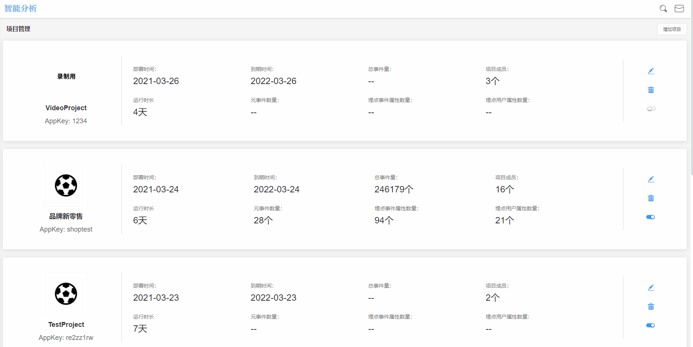

# 项目管理

项目管理模块主要是便于系统管理员对于多项目的管理操作。


项目：一个独立的数据采集工程，称之为一个项目。项目内可以包含多个产品终端类型，例如某企业拥有App端，小程序端，Web端三种产品终端类型，实施数据采集工程时，可以将三端同时接入同一个项目，也可以为三个端分别建立三个项目。


## 新建项目

点击页面右上角**新建项目**按钮，输入**项目名称**、**AppKey**，上传项目logo，点击**确认**按钮即可。


项目名称：必填项，名称最长为18位字符

AppKey：新建项目时，默认为自动生成AppKey，如需要手动设定AppKey，可以关闭自动生成AppKey开关后手动设定AppKey，AppKey由6-18位的英文、数字组成

项目logo：非必填项，当logo未上传时，用项目名称的第一个文字做项目logo。logo建议为200\*200大小的png、jpg、icon格式


### 项目数据接收开关

项目数据接收开关控制该项目下所有数据是否接收，当开关为开启状态，数据将正常经由产品上报至数据分析工作台，当开关为关闭状态，数据将停止接收。

## 编辑项目

点击项目最右侧操作栏左边的**编辑**按钮，可对项目名称进行修改，然后点击**确认**按钮即可。

## 删除项目

若需要删除某一项目，点击项目最右侧操作栏右边的**删除**按钮，输入执行者账户的登陆密码，点击**确认删除**按钮即可。


项目删除后，数据将停止接收，项目不可访问，项目中所有数据将暂时保留30天，在30天内，如有恢复数据的需求，请联系对应的客户经理

