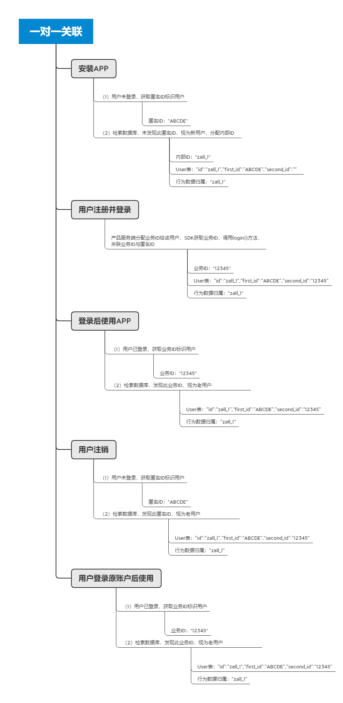
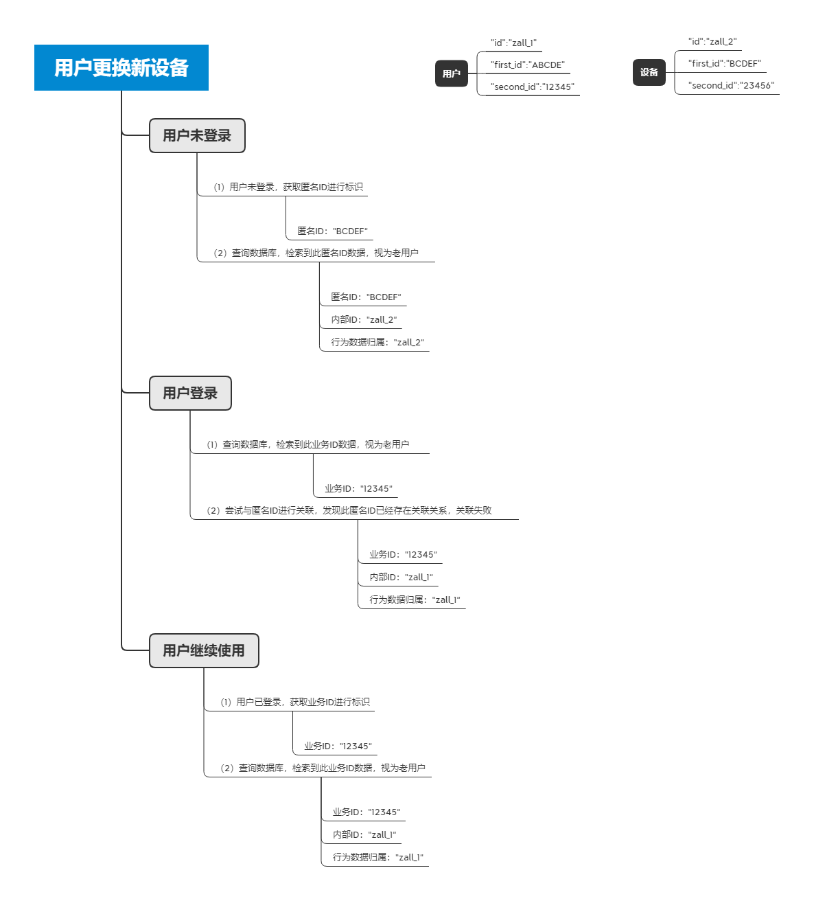
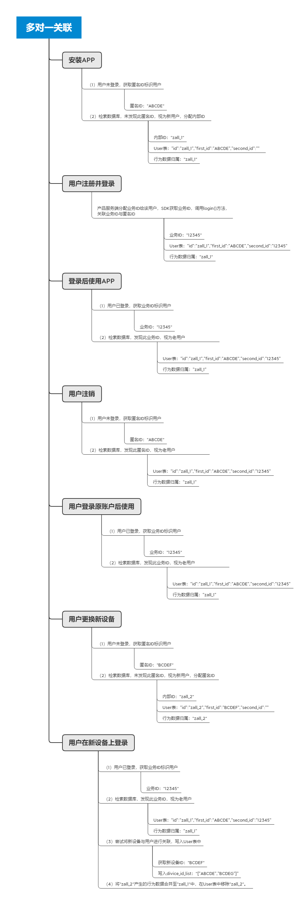

# 用户的标识与关联

## 为什么要标识用户

在[数据模型](datamodel.md)一节中，我们了解了**Event实体+User实体**为分析模块起到的支撑作用。在事件的描述上，我们通过**何人，何时，何地，何种方式以及做了某事**五要素来完成的描述一个事件，而每一个事件都是经由用户在产品上做出了相关的行为之后进行触发的，所以对于用户的标识也就成了很重要的一个点。

## 用户的两种身份与标识方法

用户在使用产品的过程中，基本分为两种身份，第一种为**游客身份**，也就是未注册登录的状态，第二种为**用户身份**，也就是用户已经注册了该产品，在用户处于游客身份时，通常使用**匿名ID**来标识一个用户。


**匿名ID：**通常为设备的唯一标识ID，不同设备的取值点有所不同，例如对于APP，Android端常取的值为Android ID，IOS端常取的值为IDFA，对于Web端来说经常取的值可能是Cookie ID，此外还有诸如IMEI，MAC地址等不同得唯一设备ID可以用来标识游客身份的用户。


当用户已经完成了产品上的注册登录过程之后，产品的服务端会依据产品本身制定的规则，分配给该用户一个ID，用以在本身的产品用户体系中唯一标识某个用户，这种ID我们称之为**业务ID**。


**业务ID：**不同产品的业务ID生成规则有所不同，但取值点相同，对于不需要注册登录的产品，业务ID可能与设备ID相同，也有可能是根据设备ID生成的一个业务ID。


## 多种业务场景造成的数据割裂

### 单设备ID进行标识

对于一些纯工具类产品来说，并没有给用户提供注册登录的入口，用户体系的搭建完全依靠获取用户的设备ID完成，这种标识方法是最简单的标识方法，同时也带来了很多弊端：

* 单用户多设备

同一个用户在多个不同的设备上使用产品，是一个很常见的业务场景，不过如果单独的使用设备ID或依据设备ID生成业务ID的方法来标识用户的话，得到的数据结果通常会存在较大的偏差，如下表所示：

| 序列 | 行为内容          | 用户判断                            |
| -- | ------------- | ------------------------------- |
| 1  | 使用华为手机打开APP使用 | 获取设备ID，查询数据库中无此设备ID，按新用户存储进用户体系 |
| 2  | 使用苹果手机打开APP使用 | 获取设备ID，查询数据库中无此设备ID，按新用户存储进用户体系 |
| 3  | 使用小米手机打开APP使用 | 获取设备ID，查询数据库中无此设备ID，按新用户存储进用户体系 |

从上方我们可以看到，**同一个用户**在切换了三个**不同的设备**使用**同一款产品**的情景下，单设备ID的标识方法将该用户标识成了三个用户。

* 多用户单设备

多个不同的用户在同一个设备上使用产品，比较常见的业务场景就是布局在网吧端的产品，受限于网吧的业务环境，多个用户在同一个设备上使用产品是不可避免的情况，此时如果使用单设备ID进行用户标识，得到的数据结果同样会存在较大的偏差，如下表所示：

| 序列 | 行为内容        | 用户判断                               |
| -- | ----------- | ---------------------------------- |
| 1  | 用户A启动机器使用产品 | 获取设备ID，查询数据库中无此设备ID，按新用户存储进用户体系    |
| 2  | 用户B启动机器使用产品 | 获取设备ID，查询数据库中存在此设备ID，将行为数据归属于该设备ID |
| 3  | 用户C启动机器使用产品 | 获取设备ID，查询数据库中存在此设备ID，将行为数据归属于该设备ID |

在这种情景下，**三个不同的用户**在**同一个设备**使**用同一款产品**，单设备ID的标识方法会将三个不同的用户标识为一个用户。

### 同时使用设备ID与业务ID进行标识

针对于单设备ID进行用户标识的弊端，我们引入了业务ID进行标识用户，产品提供给用户注册登录的入口，用户在进行注册之后，产品的服务端将依据规则分配给该用户一个唯一的**业务ID**用以标识该用户，不过这种标识方法同样存在弊端，那就是用户在注册前后及登录前后的数据无法贯通，如下表所示：

| 序列 | 行为内容      | 用户判断                                         |
| -- | --------- | -------------------------------------------- |
| 1  | 用户A启动产品   | 无法获取业务ID，获取设备ID进行标识，查询数据库内无该设备ID，按新用户存储进用户体系 |
| 2  | 用户A注册     | 分配给用户A一个唯一业务ID，按新用户存储进用户体系                   |
| 3  | 用户A继续使用产品 | 获取业务ID，查询数据库中存在该业务ID，将行为数据归属于该业务ID           |

在这种情景下，用户A在注册之前与注册之后，会被标识为两个用户，实际上是一个用户。

* 单用户多设备

在引入了业务ID对用户进行标识的情况下，一定程度解决了在单个用户在多个不同设备上进行操作的数据关联问题，但是仍然存在用户注册前后及登录前后的数据无法贯通的情况，如下表所示：

| 序列 | 行为内容           | 用户判断                                         |
| -- | -------------- | -------------------------------------------- |
| 1  | 用户A启动产品        | 无法获取业务ID，获取设备ID进行标识，查询数据库内无该设备ID，按新用户存储进用户体系 |
| 2  | 用户A注册          | 分配给用户A一个唯一业务ID，按新用户存储进用户体系                   |
| 3  | 用户A继续使用产品      | 获取业务ID，查询数据库中存在该业务ID，将行为数据归属于该业务ID           |
| 4  | 用户A更换设备启动      | 无法获取业务ID，获取设备ID进行标识，查询数据库内无该设备ID，按新用户存储进用户体系 |
|    | 用户A在新设备上登录账号   | 获取业务ID，查询数据库中存在该业务ID，将登录行为归属于该业务ID           |
| 6  | 用户A继续在新设备上使用产品 | 获取业务ID，查询数据库中存在该业务ID，将行为数据归属于该业务ID           |

在这种情景下，用户在登录后的行为数据被正确的标识为同一个用户，而用户注册前及登录前的数据，按照设备ID进行标识，被标识为两个不同的用户，实际上整个行为序列中，用户A被标识为三个用户。

* 多用户单设备

在引入业务ID来标识用户的前提下，多用户使用单设备的情况与单用户多设备的情况大致相同，同样存在用户注册前后及登录前后的数据无法贯通的情况，如下表所示：

| 序列 | 行为内容        | 用户判断                                           |
| -- | ----------- | ---------------------------------------------- |
| 1  | 用户A启动设备使用产品 | 无法获取业务ID，获取设备ID进行标识，查询数据库内无该设备ID，按新用户存储进用户体系   |
| 2  | 用户A注册       | 分配给用户A一个唯一业务ID，按新用户存储进用户体系                     |
| 3  | 用户A继续使用产品   | 获取业务ID，查询数据库中存在该业务ID，将行为数据归属于该业务ID             |
| 4  | 用户B启动设备使用产品 | 无法获取业务ID，获取设备ID进行标识，查询数据库存在该设备ID，将行为数据归属于该设备ID |
| 5  | 用户B注册       | 分配给用户B一个唯一业务ID，按新用户存储进用户体系                     |
| 6  | 用户B继续使用产品   | 获取业务ID，查询数据库中存在该业务ID，将行为数据归属于该业务ID             |

在引入业务ID进行标识之后，规避了单设备ID标识时，将多个不同用户标识为同一个用户的弊端，每一个已经注册登录的用户，在登录后的行为数据都归属于后续的业务ID下，但是仍然存在用户登录前后的数据无法贯通的情况。

## 设备与用户的绑定

为了解决用户注册前后及登录前后的数据无法贯通的情况，数据分析工作台使用ID-mapping的方法，将设备与用户关联起来，这样用户注册前后及登录前后的数据将得以贯通。我们提供了**一对一关联**，**多对一关联**两种方案供租户选择。

为了更好的理解下方**一对一关联与多对一关联**的流程逻辑，有四个概念需要您提前知晓：

> 设备ID：该设备的唯一识别ID，例如手机的IMEI序列号，Android系统的Android ID，IOS系统的IDFA码等，User表中的字段名为first_id。
>
> 业务ID：产品服务器根据一定规则分配给用户的唯一识别ID，例如手机号码，第三方关联号码，或自有规则生成的ID等等，User表中的字段名为second_id。
>
> 内部ID：数据分析工作台中用以标识用户的唯一ID，字段名为id，为User表的主键
>
> devide_id_list：当租户选择多对一关联方式时，用户表中设定的一个字段名，中文意为设备ID列表，同一业务ID所关联的所有设备ID都会以列表的方式存入这个字段中，仍然以id字段为主键。

### 一对一关联


一对一关联，即同一个业务ID，只能与一个设备ID进行关联，同一个设备ID，也只能与一个业务ID进行关联，此后在这台设备上登录的其他账户，其业务ID将无法与此设备的设备ID进行关联。


无法与设备ID进行关联的业务ID将会自关联，即将业务ID的值同时填入User表中的first_id与second_id字段中，如果触发了自关联的业务ID后续在一台“新设备”上登录，那么该业务ID将与此设备的设备ID完成关联。

完成了关联的设备ID与业务ID，工作台将分配同一个内部ID用以标识，完成了关联后，无论采集到的设备ID还是业务ID，将视为一个用户，完成用户注册前后以及登录前后的数据贯通。

以上为一对一关联的基本逻辑图，在用户使用单设备单账户的情况下，随着用户完成注册登录行为，用户的数据在注册登录前后将会贯通。

### 一对一关联的特殊情况

#### 单用户多设备

从逻辑图上我们看出，因为用户更换的新设备已经绑定了一个业务ID，此时用户自身的业务ID无法与新设备进行绑定，导致用户更换新设备到登录前的数据发生断裂。

#### 多用户单设备

与单用户多设备情形相似，还是以网吧环境为例，当第一个使用者完成了设备与业务ID的关联之后，后续的使用者如果使用同一台设备，都会因为匿名ID与业务ID关联失败，而将登录前的数据归属于第一个完成ID关联的用户。

### 多对一关联


多对一关联，即同一个业务ID可以与多个设备ID进行关联，有效的解决了同一个用户在不同的设备上登录前后的数据贯通问题，比较适用的业务场景为多端布局的产品，例如某产品同时具有Web端与App端，其产品特性限制用户必须适用不同的设备才能使用。


多对一的关联方式中，该业务ID所关联的所有设备ID，都会存入User表中的devide_id_list中，归属于同一个内部ID，后续无论用户是登录前还是登录后，无论使用哪个设备，那么都将视为一个用户。

#### 多对一关联逻辑图

多对一关联的方法解决了一对一关联时，在单用户多设备条件下造成的数据割裂问题，实现了单用户在不同类型的产品上产生的行为数据互联互通。但是，多对一关联时，一个设备ID仍然只能与一个业务ID进行关联，这就导致了当单设备多用户的使用条件下，多个用户在登录前的行为数据都会归属于第一个进行ID关联的用户。
