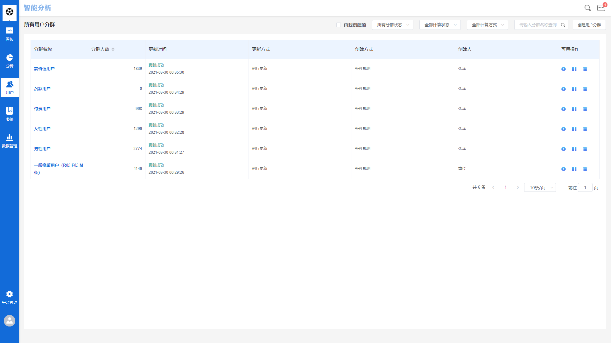
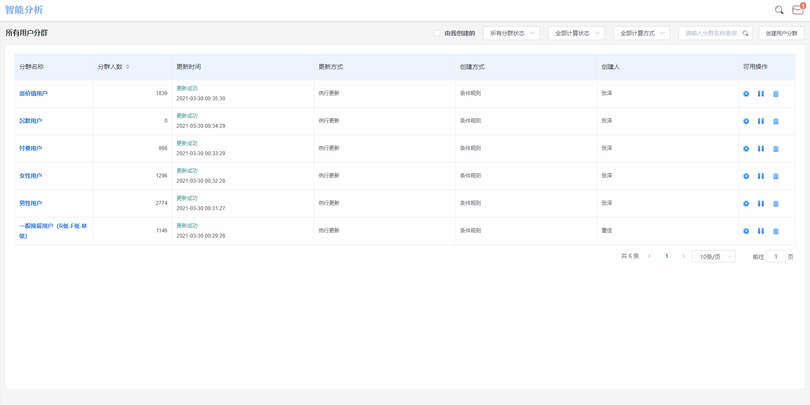
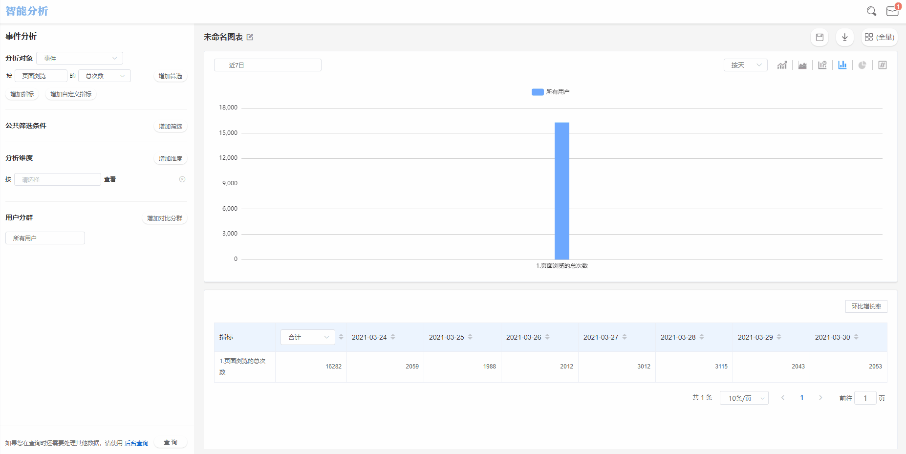
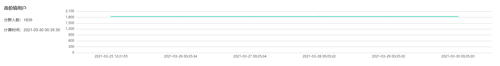
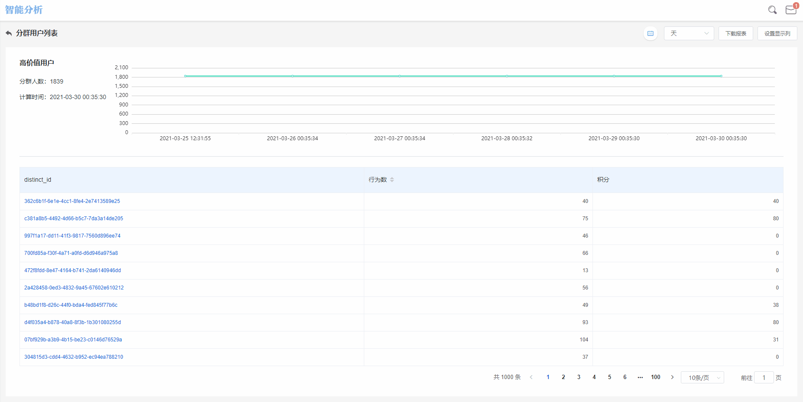

# 用户分群

不同的用户往往携带不同的用户属性，具有不同的用户行为特征。用户分群就是将用户信息标签化，通过用户的历史行为数据与用户属性数据，把具有相同属性、特征的用户进行分类，并进行后续分析。

用户分群是企业进行数据分析、精细化运营的第一步。例如通过对比分析不同人群在同一个指标上的表现，找到其背后的影响因素，就可以针对性的对产品或运营策略进行优化。

## 用户分群界面概览

## 添加用户分群

创建用户分群有三种方式，一种是通过条件规则创建，一种是通过ID上传创建，还有一种是通过分析结果保存创建。

### 条件规则创建

条件规则创建适合用户量较大的群组创建。

点击页面右上角**添加用户分群**按钮，选择**条件规则创建**，填写分群名称后选择更新方式：


例行更新：每天零点过后自动计算，

手动更新：需要操作人员每次手动更新计算。


然后设置分群规则：

#### 添加用户属性

选择想要创建的用户群组中包含的共有用户属性，例如我们想要创建安卓下单用户的群组，则需要在在此处选择**操作系统**为**Android**；

#### 添加触发事件

选择想要创建的用户群组中都会触发的事件，例如我们想要创建近30日安卓下单用户的群组，则需要在此处选择时间范围为**近30日**，触发事件为**支付订单**总次数≥1。

#### 选择用户属性和触发事件之间的逻辑关系

此处可以选择“且”或者“或”两种逻辑关系，选择“且”表示在符合设定的用户属性的同时还要触发设置的事件，选择“或”则表示用户属性和触发事件之间只要符合其中任意一个即可收入该用户群组。

### ID上传创建

ID上传适合用户量较小的群组创建。

点击页面右上角**添加用户分群**按钮，选择**ID上传**，填写分群名称，点击**选择文件**按钮，上传一个固定格式的TXT格式的ID列表文档，点击**确定**即可。


上传文件的格式为一行一个用户ID的TXT格式文档，若不清楚ID列表文档格式，可先点击右边下载模板按钮查看具体格式类型。


### 分析结果保存

通过高级分析模型得出人群结果后，点击该数字，在提示框中选择**保存用户分群**，输入分群名称，点击**确认**按钮即可。

## 管理用户分群

### 用户分群界面标签释义


分群名称：该群组创建时的名称，用以标识该分群的概要信息

分群人数：经过筛选计算后最终得出的该群组用户总数

更新时间：展示该群组最近一次更新时间

创建方式：展示该群组是通过何种方式创建的

创建人：展示创建该群组的用户名称


### 编辑用户分群

点击某个用户分群右侧的**设置**按钮，可对已创建的用户分群进行条件设置。


创建方式：用户分群一旦创建，其创建方式不支持修改

分群名称：可对分群名称进行修改，输入新的分群名称，点击确认按钮即可

更新方式：可对分群更新方式进行修改，选择例行更新或手动更新

分群规则：可对分群用户属性、触发事件，以及两者的逻辑关系进行修改


### 用户分群更新的启动与暂停

当某个用户分群处于**按设定规则更新**的状态时，右侧操作标签下展示**暂停更新**按钮，点击暂停更新，此分群的数据将暂停更新。

当某个用户分群处于**暂停更新**的状态时，右侧操作标签下展示**启用更新**按钮，点击启用更新，此分群的数据将按照设定的更新规则进行更新。

### 删除用户分群

对于自己创建的用户分群想要进行删除的，找到该分群，点击该分群最右侧**删除**按钮删除即可。

对于别人创建的用户分群，除项目管理员及数据分析师以外，其他角色均没有权限进行此操作。

### 用户分群的筛选

智能分析平台提供了三种对用户分群进行筛选的方式：

#### 分群状态筛选

该功能按钮有三个选项，分别是**全部**、**正常运行**、**暂停中**，选择**全部**将展示所有用户群组，选择**正常运行**将展示所有正常更新运行中的用户群组，选择**暂停中**将展示所有暂停更新的用户群组。

#### 计算状态

该功能按钮有四个选项，分别是**全部**、**成功**、失败、**等待计算**，选择**全部**将展示所有计算状态的用户群组，选择**成功**将展示所有计算成功的用户群组，以此类推。

#### 创建方式

该功能按钮有四个选项，分别是**全部**、**条件规则创建**、**分析结果保存**、**ID上传**，选择**全部**将展示所有用户群组，选择**条件规则创建**将展示所有通过条件规则创建的用户群组，以此类推。

## 查看用户分群详情

### 用户分群详情页概览

在用户分群列表中点击用户分群名称，即可进入该用户群组的详情页。

### 用户分群详情页图表解释

#### 折线图

折线图表示此用户分群中的**用户数**随着时间变动的趋势。

#### 自定义表格

自定义表格如上图所示，其中，列表头为全部用户属性中的数个用户属性，具体需要由使用者自定义，点击**设置显示列**将弹出列表头设置窗：


左侧：全部的用户属性

右侧：需要展示在列表头的用户属性


在右侧配置完成需要展示在列表头的用户属性之后，点击右下角的**保存**按钮，选定的用户属性将展示在列表头内。

### 用户分群详情页时间范围切换

点击用户分群详情页上方的**时间范围选择器**，可以选择查询的数据时间范围。关于时间范围选择的详细信息请参考[时间范围](basic/timerange.md)。

## 单个用户行为详情

在用户分群详情页的用户列表中，点击某个用户ID，即可进入此用户的行为详情页，页面中共展示四个图表：

#### 行为趋势图

行为趋势图位于用户行为详情页的左上角，表示此用户触发的事件量随着时间变动而变动的趋势情况。

#### 行为洞悉环图

行为洞悉环图位于用户行为详情页的右上角，表示此用户触发的所有事件中，每个独立事件占总事件量的比例情况。

#### 行为序列图

行为序列图位于用户行为详情页的左下角，表示此用户在选定的数据查询时间范围中，以日期时间降序展示的详细行为序列。

点击行为序列中的某个行为后，将展开此行为的事件属性与用户属性。

#### 用户属性表

用户属性表位于用户行为详情页的右下角，表中展示了此用户的全部用户属性。
