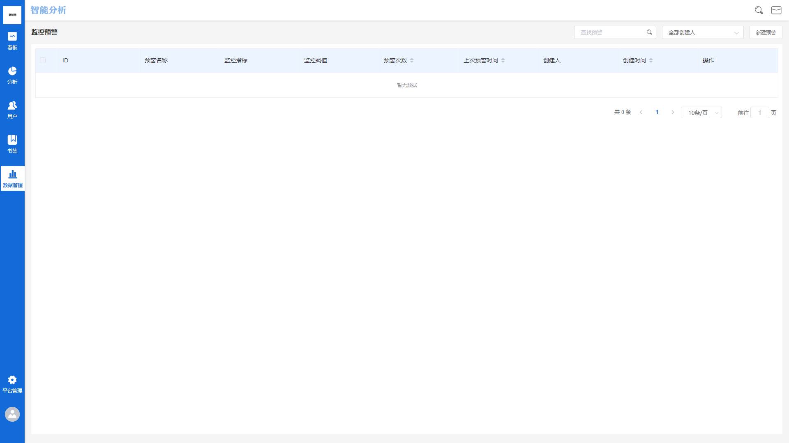
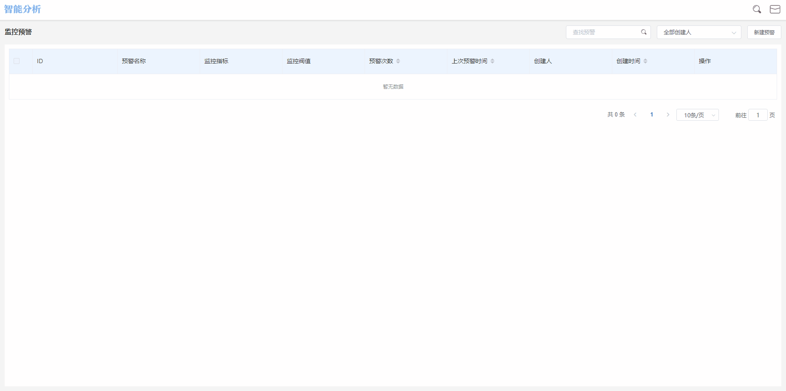
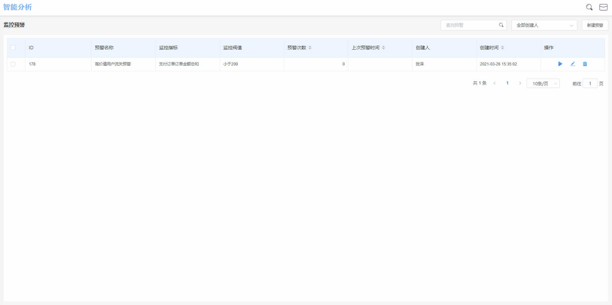

# 监控预警

在业务运作的过程中，尤其是线上业务，一些数据指标必须时刻关注，一旦指标背后的业务场景出现了问题，就意味着实际上的经济损失，必须立刻进行解决及时止损。

高价值用户是运营过程中重点关注的用户群体，如何时时刻刻关注到高价值用户的行为呢？

监控预警的意义就在于此，人的精力无法覆盖全天24小时的监控，而监控预警模块可以在服务端全天候对设定的监控指标进行监控，一旦数据变化超过了设定的阈值规则，将立即触发告警机制。

## 监控预警界面概览

监控预警管理界面由两个部分组成，分别为左侧的**导航功能区**以及右侧的**展示功能区**，租户可以通过监控预警管理模块对已经创建完成的预警规则进行管理，同时可通过此模块创建新的监控预警规则。

## 界面各标签释义

监控预警管理界面主要包含**预警名称**，**预警指标**，**预警次数**，**上次预警时间**，**创建人**，**创建时间**六个标签组成，各标签代表的含义如下：


预警名称：创建此预警规则时命名的名称

预警指标：创建此预警规则时配置的规则详情

预警次数：此预警规则触发告警的次数

上次预警时间：此预警规则最近一次触发告警的时间点

创建人：此预警规则的创建者账户名

创建时间：此预警规则创建时的时间点


## 新建预警规则

点击监控预警管理界面右上角**新建预警**按钮，页面右侧将弹出监控预警规则设置窗，依次设置下列内容即可完成监控预警规则的创建：

此监控预警规则的名称，例如“高价值用户流失预警”。

### 预警指标

预警指标的选择由**事件选择器**及**用户群选择器**构成，首先需要在用户群选择器中选择需要监控的用户群组，如不需特定监控某个用户群，可以直接选择默认的“所有用户”，此例中选择“高价值用户”。

接下来，在事件选择器中配置需要监控的数据指标，可以设置为：​支付订单事件-订单金额-总和​

### 预警规则

#### 计算周期

计算周期的配置结构为**周期选项+时间选项**组成，其中周期选项共有四个选项可以选择，分别为**每小时**，**每天**，**每周一**，**每月第一天**，选择不同的周期选项，后方可配置的时间选项也有所不同：

| 周期选项  | 时间选项 | 示例                            |
| ----- | ---- | ----------------------------- |
| 每小时   | 第N分钟 | “每小时第5分钟”代表每小时第5分钟对比上一小时数据    |
| 每天    | 具体时间 | “每天8：00”代表每天8：00对比上一天数据       |
| 每周一   | 具体时间 | “每周一8：00”代表每周一8：00对比上一周数据     |
| 每月第一天 | 具体时间 | “每月第一天8：00”代表每月第一天8：00对比上一月数据 |

#### 循环周期

循环周期的配置结构为**监控日期循环+时间范围**组成，其中监控日期循环表示在一个完整周中，需要监控哪些天，以周一至周日表示，时间范围为监控日期循环中每天的具体时间范围。

例如选择“周二、周三、周四”的“00：00至23：59”，表示的就是在每周二、周三、周四的00：00至23：59执行监控。


当计算周期选择每周一、每月第一天时，不需要配置循环周期


#### 告警规则

告警规则即设定**告警阈值**，告警阈值的类型可以为数值或百分比。

告警规则的可配置项依据**计算周期**决定，具体组合可参照下表：

| 计算周期  | 对比逻辑 | 对比周期    | 告警阈值   | 阈值类型 |
| ----- | ---- | ------- | ------ | ---- |
| 每小时   | 大于   | 不可选     | 根据业务设定 | 数值   |
| 每小时   | 小于   | 不可选     | 根据业务设定 | 数值   |
| 每小时   | 增长超过 | 上一小时    | 根据业务设定 | 数值   |
| 每小时   | 增长超过 | 上一小时    | 根据业务设定 | 百分比  |
| 每小时   | 增长超过 | 上一日同一小时 | 根据业务设定 | 数值   |
| 每小时   | 增长超过 | 上一日同一小时 | 根据业务设定 | 百分比  |
| 每小时   | 减少超过 | 上一小时    | 根据业务设定 | 数值   |
| 每小时   | 减少超过 | 上一小时    | 根据业务设定 | 百分比  |
| 每小时   | 减少超过 | 上一日同一小时 | 根据业务设定 | 数值   |
| 每小时   | 减少超过 | 上一日同一小时 | 根据业务设定 | 百分比  |
| 每天    | 大于   | 不可选     | 根据业务设定 | 数值   |
| 每天    | 小于   | 不可选     | 根据业务设定 | 数值   |
| 每天    | 增长超过 | 上一天     | 根据业务设定 | 数值   |
| 每天    | 增长超过 | 上一天     | 根据业务设定 | 百分比  |
| 每天    | 增长超过 | 上一周同一天  | 根据业务设定 | 数值   |
| 每天    | 增长超过 | 上一周同一天  | 根据业务设定 | 百分比  |
| 每天    | 增长超过 | 上一月同一天  | 根据业务设定 | 数值   |
| 每天    | 增长超过 | 上一月同一天  | 根据业务设定 | 百分比  |
| 每天    | 增长超过 | 上一年同一天  | 根据业务设定 | 数值   |
| 每天    | 增长超过 | 上一年同一天  | 根据业务设定 | 百分比  |
| 每天    | 减少超过 | 上一天     | 根据业务设定 | 数值   |
| 每天    | 减少超过 | 上一天     | 根据业务设定 | 百分比  |
| 每天    | 减少超过 | 上一周同一天  | 根据业务设定 | 数值   |
| 每天    | 减少超过 | 上一周同一天  | 根据业务设定 | 百分比  |
| 每天    | 减少超过 | 上一月同一天  | 根据业务设定 | 数值   |
| 每天    | 减少超过 | 上一月同一天  | 根据业务设定 | 百分比  |
| 每天    | 减少超过 | 上一年同一天  | 根据业务设定 | 数值   |
| 每天    | 减少超过 | 上一年同一天  | 根据业务设定 | 百分比  |
| 每周一   | 大于   | 不可选     | 根据业务设定 | 数值   |
| 每周一   | 小于   | 不可选     | 根据业务设定 | 数值   |
| 每周一   | 增长超过 | 上一周     | 根据业务设定 | 数值   |
| 每周一   | 增长超过 | 上一周     | 根据业务设定 | 百分比  |
| 每周一   | 增长超过 | 上一月同一周  | 根据业务设定 | 数值   |
| 每周一   | 增长超过 | 上一月同一周  | 根据业务设定 | 百分比  |
| 每周一   | 增长超过 | 上一年同一周  | 根据业务设定 | 数值   |
| 每周一   | 增长超过 | 上一年同一周  | 根据业务设定 | 百分比  |
| 每周一   | 减少超过 | 上一周     | 根据业务设定 | 数值   |
| 每周一   | 减少超过 | 上一周     | 根据业务设定 | 百分比  |
| 每周一   | 减少超过 | 上一月同一周  | 根据业务设定 | 数值   |
| 每周一   | 减少超过 | 上一月同一周  | 根据业务设定 | 百分比  |
| 每周一   | 减少超过 | 上一年同一周  | 根据业务设定 | 数值   |
| 每周一   | 减少超过 | 上一年同一周  | 根据业务设定 | 百分比  |
| 每月第一天 | 大于   | 不可选     | 根据业务设定 | 数值   |
| 每月第一天 | 小于   | 不可选     | 根据业务设定 | 数值   |
| 每月第一天 | 增长超过 | 上一月     | 根据业务设定 | 数值   |
| 每月第一天 | 增长超过 | 上一月     | 根据业务设定 | 百分比  |
| 每月第一天 | 增长超过 | 上一季度同一月 | 根据业务设定 | 数值   |
| 每月第一天 | 增长超过 | 上一季度同一月 | 根据业务设定 | 百分比  |
| 每月第一天 | 增长超过 | 上一年同一月  | 根据业务设定 | 数值   |
| 每月第一天 | 增长超过 | 上一年同一月  | 根据业务设定 | 百分比  |
| 每月第一天 | 减少超过 | 上一月     | 根据业务设定 | 数值   |
| 每月第一天 | 减少超过 | 上一月     | 根据业务设定 | 百分比  |
| 每月第一天 | 减少超过 | 上一季度同一月 | 根据业务设定 | 数值   |
| 每月第一天 | 减少超过 | 上一季度同一月 | 根据业务设定 | 百分比  |
| 每月第一天 | 减少超过 | 上一年同一月  | 根据业务设定 | 数值   |
| 每月第一天 | 减少超过 | 上一年同一月  | 根据业务设定 | 百分比  |

#### 预警方式

当监控预警规则被触发，会通过**邮件**的方式发送预警消息，我们需要设置邮件地址以方便接受提醒。

除了邮件提醒，系统也会通过消息中心后台发送预警消息，内容包括预警名称、预警详情、预警时间，以便第一时间发现指标异常。

以上四项设置完成之后，点击右下角**确定**按钮，即可创建完成一个新的预警规则。

## 管理预警规则

所有创建完成的预警规则，都会在监控预警管理界面中展示，通过监控预警模块可以执行对预警规则的**启动&关闭**，**编辑**，**删除**等操作。

### 启动与关闭

#### 单独操作

如果预警规则处于关闭状态，点击**启动**按钮，即可启动此预警规则，启动后监控预警模块会按照设定的预警规则执行。

如果预警规则处于启动状态，点击**关闭**按钮，即可关闭此预警规则，预警规则关闭后将处于沉默状态，监控预警模块不会执行此规则。

#### 批量操作

点选已经创建好的预警规则旁边的复选框，可以批量选择预警规则，选择完成后，点击界面左上角的**启动**，**停止**按钮，可以对预警规则进行批量启动或关闭。

### 修改预警规则

点击**编辑**按钮，可以对已经创建好的预警规则进行修改编辑，修改的过程与创建的过程相同，修改完成后，点击**确定**按钮，即可保存修改结果。

### 删除预警规则

#### 单独操作

为了避免误操作，点击**删除**按钮之后，将弹出删除二次确认弹窗，点击确认后，预警规则将被删除，此操作不可恢复。

#### 批量操作

点选已经创建好的预警规则旁边的复选框，可以批量选择预警规则，选择完成后，点击界面左上角的删除按钮，即可开始批量删除预警规则，为了避免误操作，点击**删除**按钮后，将弹出删除二次确认弹窗，点击确认后，所选择的预警规则将被删除，此操作不可恢复。

## 搜索与筛选

### 筛选本账号创建的

在界面上方，设有**由我创建**的复选框，勾选此复选框后，展示功能区内将筛选出当前登录账号所创建的预警规则列表，如果勾选后显示暂无数据，则说明当前登录的账号没有创建过预警规则或创建的预警规则已被删除。

### 根据预警规则创建人筛选

如需要根据预警规则创建人进行筛选，可以点击上方的创建人下拉框，选择需要的创建人后，展示功能区内将筛选出此创建人所创建的预警规则。

### 搜索

在搜索输入框内输入预警规则名称，展示功能区将实时根据输入的内容进行筛选，如果输入后界面显示暂无数据，则说明没有预警规则名称包含当前输入的关键词。

## 业务实例

回顾本节最开始描述的“错误优惠券”问题，我们可以将监控预警规则设置如下：


**预警名称：**

高价值用户流失预警

**预警指标：**

事件选择：支付订单-订单金额-人均值

用户群选择：所有用户

**预警规则：**

计算周期：每小时第5分钟计算

循环周期：按周一、周二、周三、周四、周五、周六、周日的00：00至23：59进行循环

告警规则：当指标小于200时触发告警

**预警方式：**

告警方式：邮件

邮箱地址：需要接受告警的人员邮箱地址


按照上方设置完成预警规则后，每小时的第5分钟，监控预警模块会计算上一小时高价值用户的成单金额人均值是否低于200元，如果低于200元，将立即触发预警，相关人员可以在最短的时间内接收异常信息，及时对高价值用户进行回访。
